# ADDIE Application

### Aim 
Apply ADDIE Framework for training and awareness program

### Outcomes
- TNA 
- Blooms Taxonomy
- 10 Minute Learning module
- PPT For Awareness
- Enterprise Evaluation score 4 KirkPatrick principles

# Step 1: Training Needs Analysis — MedVitals Ransomware Incident

## 1. Purpose of the Training Needs Analysis

The Training Needs Analysis identifies the specific human behaviors, environmental pressures, and knowledge gaps that contributed to the MedVitals ransomware incident.

The purpose is not merely to teach employees the definition of phishing. The training must address the exact behaviors that allowed the ransomware to execute and spread, including:

* Failure to inspect the sender’s domain
* Trusting a file based on its icon
* Failure to recognize a double-extension file
* Opening an unexpected attachment
* Ignoring abnormal system behavior
* Deleting the suspicious email instead of reporting it
* Delayed notification to the cybersecurity team

---

# 2. Incident-Based TNA Mind Map

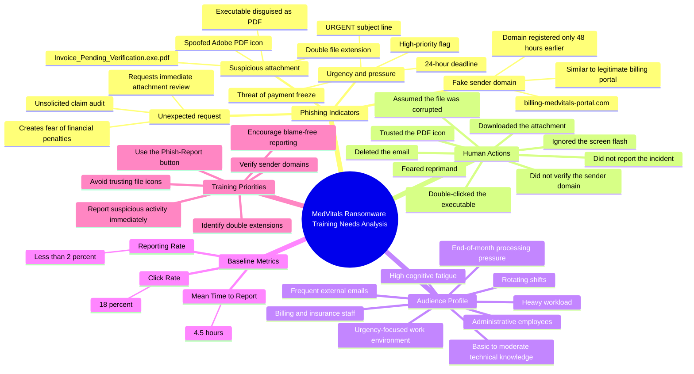

---

# 3. Phishing Indicators Identified

The phishing email contained several technical and psychological warning signs. These indicators should form the basis of the security awareness training.

| Category                   | Exact indicator                                    | Why it was suspicious                                                                      | Required employee behavior                                      |
| -------------------------- | -------------------------------------------------- | ------------------------------------------------------------------------------------------ | --------------------------------------------------------------- |
| Sender domain              | `claims-verification@billing-medvitals-portal.com` | The domain imitated the legitimate MedVitals billing portal but was not an approved domain | Compare the sender domain against the official domain whitelist |
| Recently registered domain | Domain registered 48 hours before the attack       | Newly registered look-alike domains are commonly used for phishing                         | Report unfamiliar or newly observed billing domains             |
| Urgent subject             | “URGENT: Outstanding Claim Audit”                  | Urgency was used to reduce careful decision-making                                         | Pause and inspect the message before acting                     |
| Threatening consequence    | Payment freeze within 24 hours                     | The attacker created fear of financial and compliance consequences                         | Verify the request using an official communication channel      |
| High-priority flag         | Email marked as high priority                      | Artificial importance encouraged rapid action                                              | Treat urgency as a warning sign rather than proof of legitimacy |
| Unexpected attachment      | Verification ledger attached without prior notice  | Unsolicited attachments can contain malware                                                | Do not open unexpected attachments                              |
| Double extension           | `Invoice_Pending_Verification.exe.pdf`             | The file was an executable disguised as a PDF                                              | Inspect the complete file name and extension                    |
| Spoofed PDF icon           | File displayed an Adobe Acrobat icon               | File icons can be changed and cannot prove file type                                       | Check the extension rather than trusting the icon               |
| Generic greeting           | “Dear Billing Team”                                | The message was not personalized despite claiming to concern specific transactions         | Verify the sender and request                                   |
| Immediate action request   | “Review and confirm immediately”                   | The attacker discouraged independent verification                                          | Use a secondary channel to validate the request                 |

---

## Phishing Indicator Classification

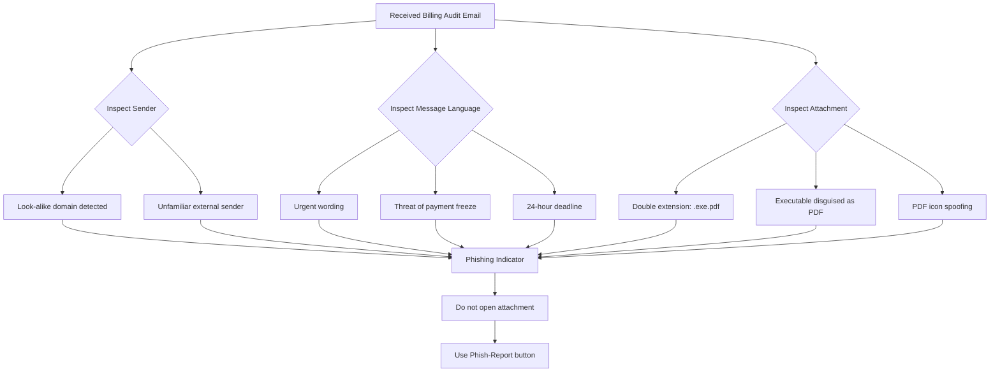

---

# 4. Human Actions That Enabled the Incident

The ransomware infection was not caused by a single action. It resulted from a sequence of decisions and reporting failures.

| Sequence | Human action                                        | Behavioral vulnerability                                | Security consequence                                    |
| -------: | --------------------------------------------------- | ------------------------------------------------------- | ------------------------------------------------------- |
|        1 | Employee accepted the email as legitimate           | Authority bias and urgency bias                         | Phishing message was not challenged                     |
|        2 | Employee did not inspect the sender domain          | Lack of domain-verification habit                       | Look-alike domain remained undetected                   |
|        3 | Employee downloaded the attachment                  | Automatic compliance with work-related requests         | Malicious file entered the endpoint                     |
|        4 | Employee trusted the Adobe PDF icon                 | Overreliance on visual appearance                       | Executable was mistaken for a document                  |
|        5 | Employee did not inspect the complete extension     | Lack of file-extension awareness                        | `.exe` component was missed                             |
|        6 | Employee double-clicked the attachment              | Action taken without verification                       | Malware executed                                        |
|        7 | Employee ignored the screen flash                   | Failure to recognize anomalous behavior                 | Possible compromise was not escalated                   |
|        8 | Employee assumed the file was corrupted             | Normalization of suspicious behavior                    | Threat remained active                                  |
|        9 | Employee deleted the email                          | Workspace-cleaning behavior replaced incident reporting | Evidence was removed from immediate view                |
|       10 | Employee did not notify IT                          | Fear of reprimand                                       | Host was not isolated                                   |
|       11 | Reporting was delayed for approximately three hours | Weak security reporting culture                         | Ransomware moved laterally and reached critical systems |

---

## Human Error and Incident Progression

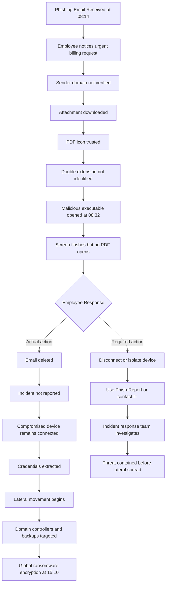

---

# 5. Root Human Behavioral Vulnerabilities

## 5.1 Urgency Bias

The employee gave greater importance to the claimed 24-hour deadline than to normal verification procedures.

The attacker successfully used:

* Fear of compliance failure
* Fear of delayed insurance payouts
* High-priority formatting
* End-of-month workload pressure

### Training need

Employees must be taught that urgency is a reason to verify a request, not a reason to bypass security controls.

---

## 5.2 Visual Trust Bias

The employee trusted the attachment because it displayed a familiar Adobe PDF icon.

### Training need

Employees must understand that:

* Icons can be spoofed
* File names can contain multiple extensions
* The final executable extension determines the actual file type
* Unexpected files must be reported rather than opened

---

## 5.3 Lack of Domain Verification

The employee did not compare the sender’s domain with the official claims portal domain.

### Training need

Employees should be able to:

* Read the full sender address
* Identify look-alike domains
* Compare domains against an approved whitelist
* Escalate unfamiliar domains

---

## 5.4 Reporting Avoidance

The employee feared being blamed for opening the file and therefore deleted the email.

This was the most serious behavioral failure because immediate reporting could have allowed the incident response team to isolate the workstation.

### Training need

The organization must establish a blame-free reporting culture that communicates:

> Reporting a mistake immediately is a security success. Concealing or delaying the report increases organizational damage.

---

# 6. Target Audience Profile

## Primary Target Audience

The primary audience consists of administrative and operational employees who regularly handle external emails, attachments, billing information, patient records, insurance documents, and vendor communication.

### Primary departments

* Patient Billing
* Insurance Verification
* Finance and Accounts
* Procurement
* Hospital Administration
* Front Desk and Admissions
* Human Resources
* Outpatient Clinic Administration

---

## Audience Profile Table

| Audience factor           | Profile                                                                                                                     |
| ------------------------- | --------------------------------------------------------------------------------------------------------------------------- |
| Role type                 | Administrative, billing, insurance, finance, and support employees                                                          |
| Technical baseline        | Basic to moderate computer literacy                                                                                         |
| Security knowledge        | Limited understanding of domains, executable files, file extensions, and malware behavior                                   |
| Common systems            | Email, billing portals, EHR systems, document management systems, Microsoft Office, PDF readers                             |
| Email exposure            | High volume of external communication and attachments                                                                       |
| Work environment          | Fast-paced healthcare environment                                                                                           |
| Operational urgency       | High because delays can affect billing, claims, patient admission, and clinical operations                                  |
| Workload pattern          | Peak workload during end-of-month processing                                                                                |
| Shift conditions          | Rotating shifts and irregular working hours                                                                                 |
| Cognitive condition       | High fatigue, multitasking, and reduced attention                                                                           |
| Psychological pressure    | Fear of missing deadlines, causing financial loss, or being reprimanded                                                     |
| Likely attacker strategy  | Urgent billing messages, fake patient documents, insurance disputes, claim audits, payroll notices, and compliance requests |
| Preferred learning format | Short, visual, scenario-based, mobile-accessible micro-learning                                                             |
| Required behavior         | Stop, verify, avoid opening, report immediately, and preserve evidence                                                      |

---

## Audience Profile Mind Map

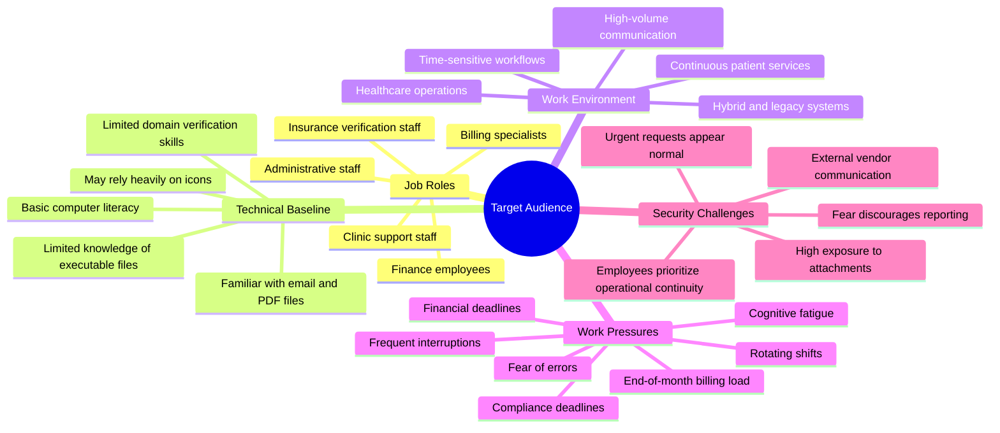

---

# 7. Performance Gap Analysis

| Required secure behavior             | Current observed behavior         | Identified gap                                    | Training requirement                                                |
| ------------------------------------ | --------------------------------- | ------------------------------------------------- | ------------------------------------------------------------------- |
| Verify the sender’s full domain      | Domain was not checked            | Employees may focus only on the display name      | Teach domain inspection using real examples                         |
| Inspect the complete file extension  | File was trusted as a PDF         | Employees may not understand double extensions    | Demonstrate `.exe.pdf` attacks                                      |
| Avoid opening unexpected attachments | Attachment was opened immediately | Urgency overrode caution                          | Introduce a stop–verify–report decision model                       |
| Recognize abnormal endpoint behavior | Screen flash was ignored          | Employees may not recognize compromise indicators | Teach immediate response to flashes, crashes, or unexpected windows |
| Report suspicious emails             | Email was deleted                 | Employees may confuse deletion with reporting     | Demonstrate the Phish-Report process                                |
| Report mistakes without delay        | Employee feared reprimand         | Reporting culture is psychologically unsafe       | Reinforce blame-free and rapid reporting                            |
| Report within minutes                | Baseline mean is 4.5 hours        | Reporting is excessively delayed                  | Establish a target reporting time below 15 minutes                  |
| Preserve evidence                    | Email was deleted                 | Employees may destroy useful evidence             | Teach users to report before deleting                               |

---

# 8. Incident Vector-to-Training Need Mapping

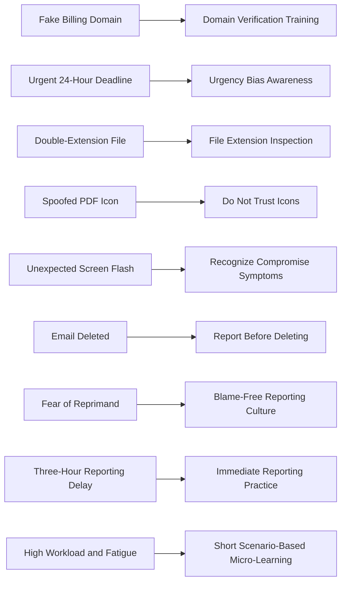

---

# 9. Pre-Training Baseline Metrics

The following baseline metrics represent employee behavior before the training intervention.

| Metric                             |        Baseline value | Interpretation                                                   | Desired future direction                 |
| ---------------------------------- | --------------------: | ---------------------------------------------------------------- | ---------------------------------------- |
| Phishing attachment click rate     |                   18% | Almost 1 in 5 employees may interact with a malicious attachment | Reduce significantly                     |
| Phishing reporting rate            |          Less than 2% | Very few employees report suspicious messages                    | Increase significantly                   |
| Mean time to report                |             4.5 hours | Reporting delay gives attackers time to move laterally           | Reduce to minutes                        |
| Domain verification behavior       | Not formally measured | Employees may not inspect domains consistently                   | Introduce measurable simulation criteria |
| Correct use of Phish-Report button | Not formally measured | Employees may delete suspicious messages instead of reporting    | Track through email security platform    |
| Recognition of double extensions   | Not formally measured | Major knowledge and behavior gap                                 | Test through scenario assessments        |

---

## Baseline Metrics Visualization

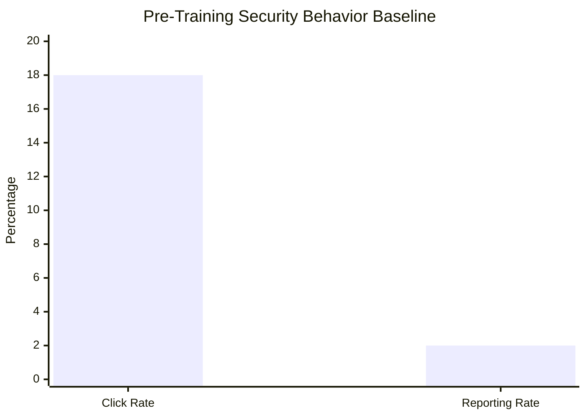

> The reporting rate is shown as 2% for visualization purposes, although the actual baseline is below 2%.

---

## Mean Time to Report

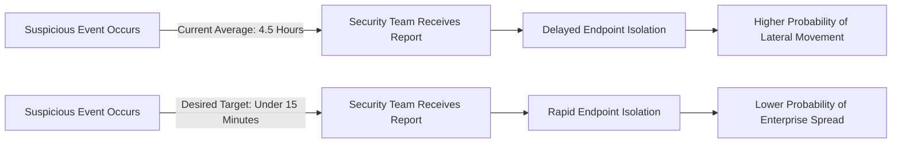

---

# 10. TNA Priority Matrix

| Training need                           | Risk severity | Current capability          | Training priority              |
| --------------------------------------- | ------------- | --------------------------- | ------------------------------ |
| Immediate incident reporting            | Critical      | Very low                    | Highest                        |
| Double-extension identification         | Critical      | Low                         | Highest                        |
| Sender-domain verification              | High          | Low                         | High                           |
| Recognition of urgency tactics          | High          | Moderate to low             | High                           |
| Correct use of Phish-Report button      | Critical      | Very low                    | Highest                        |
| Recognition of abnormal system behavior | High          | Low                         | High                           |
| Blame-free security reporting           | Critical      | Weak organizational culture | Highest                        |
| General ransomware terminology          | Medium        | Unknown                     | Lower than behavioral training |

---

## Priority Matrix Diagram

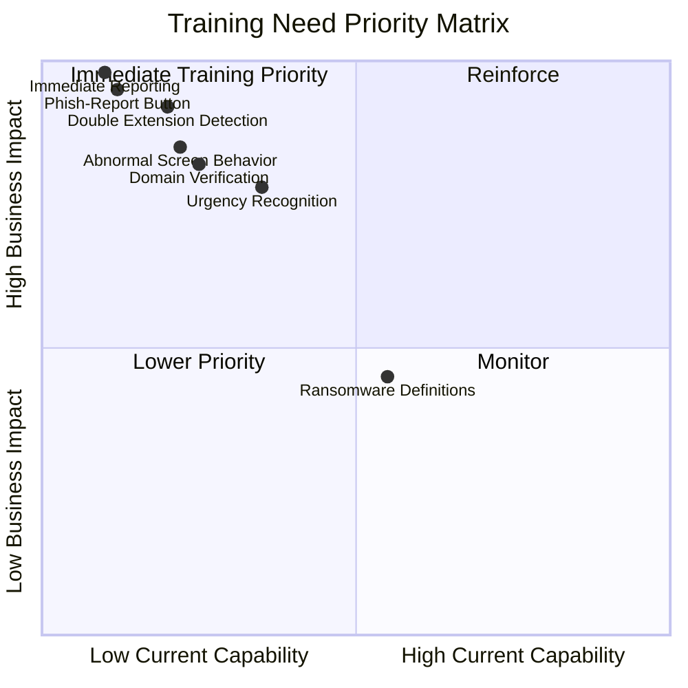

---

# 11. Recommended Core Behavioral Model

The training should teach employees to use the following decision process whenever they receive an unexpected email or attachment.

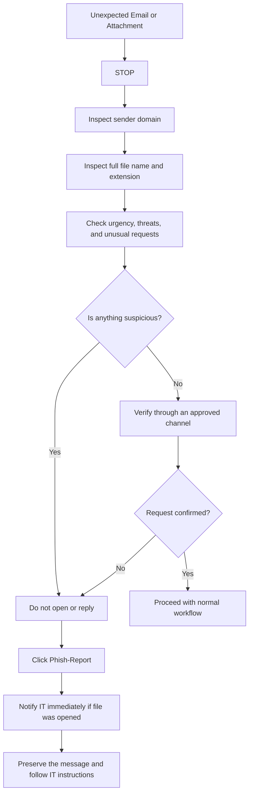

The model can be summarized as:

## Stop — Inspect — Verify — Report

1. **Stop:** Do not react immediately to urgent language.
2. **Inspect:** Examine the sender domain, file name, extension, and request.
3. **Verify:** Confirm unexpected requests through an approved communication channel.
4. **Report:** Use the Phish-Report button immediately when suspicious activity is observed.

---

# 12. Final Training Needs Identified

Based on the incident, the training program must enable employees to:

1. Inspect the complete sender email address instead of trusting the display name.
2. Compare external billing domains against the official domain whitelist.
3. Identify double-extension files such as `.exe.pdf`.
4. Understand that a PDF icon does not guarantee that a file is a PDF.
5. Pause when emails use urgency, authority, fear, or financial pressure.
6. Avoid opening unexpected attachments.
7. Recognize abnormal screen flashes or failed document openings as possible compromise indicators.
8. Use the corporate Phish-Report button instead of merely deleting suspicious emails.
9. Report accidental clicks immediately.
10. Understand that prompt reporting is encouraged and will not result in punishment.
11. Reduce the reporting delay from hours to minutes.
12. Apply secure behavior during realistic billing and healthcare scenarios.

---

# 13. TNA Conclusion

The MedVitals ransomware incident resulted from a combination of technical deception, high workload, urgency bias, insufficient file-extension awareness, and a weak reporting culture.

The most important training gap was not merely the employee’s inability to identify a phishing message. The most damaging behavior was the failure to report the abnormal event immediately.

Therefore, the proposed SETA micro-learning program should prioritize observable employee actions:

* Verify the sender
* Inspect the complete attachment name
* Avoid opening suspicious files
* Report suspicious activity immediately
* Use the Phish-Report button
* Report mistakes without fear of reprimand

The baseline metrics demonstrate an urgent need for intervention:

* **Click Rate:** 18%
* **Reporting Rate:** Less than 2%
* **Mean Time to Report:** 4.5 hours

These metrics will be used later to measure the effectiveness of the training during the Evaluation phase of the ADDIE framework.

  Below are the remaining deliverables after **Step 2**.

---

# Step 3 – 10-Minute Module Storyboard

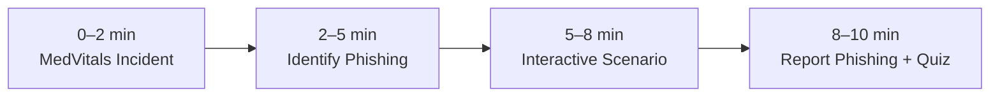

| Time     | Activity                              | Learning Objective              |
| -------- | ------------------------------------- | ------------------------------- |
| 0–2 min  | Explain MedVitals attack and impact   | Understand why phishing matters |
| 2–5 min  | Show fake email and `.exe.pdf` attack | Identify phishing indicators    |
| 5–8 min  | Learner chooses correct response      | Apply safe decision making      |
| 8–10 min | Show Phish-Report process + Quiz      | Report incidents correctly      |

---

# Step 4 – Behavioural Quiz

### Q1

You receive an unexpected billing email with an attachment.

* A. Open it
* B. Delete it
* ✅ C. Verify sender and report if suspicious
* D. Forward to coworker

---

### Q2

Which attachment is suspicious?

* A. Invoice.pdf
* ✅ B. Invoice.exe.pdf
* C. Receipt.docx
* D. Report.xlsx

---

### Q3

After opening a file your screen flashes and nothing opens.

* A. Restart PC
* B. Ignore it
* ✅ C. Report immediately
* D. Delete the email

---

### Q4

Which is the biggest phishing indicator?

* A. Company logo
* B. PDF icon
* ✅ C. Fake sender domain
* D. Professional formatting

---

### Q5

What should you do before opening unexpected attachments?

* A. Trust the icon
* B. Open quickly
* ✅ C. Verify sender and file
* D. Ignore warnings

---

# Step 5 – Implementation Strategy

## Deployment Plan

| Week      | Activity                  |
| --------- | ------------------------- |
| Week 1    | Assign training           |
| Week 2    | Employees complete module |
| Week 3    | Run phishing simulation   |
| Monthly   | Refresher micro-learning  |
| Quarterly | Security review           |

---

## Tracking Timeline

* LMS tracks completion
* Quiz scores recorded
* Phishing simulation results monitored
* Monthly reporting metrics reviewed

---

## Escalation Path

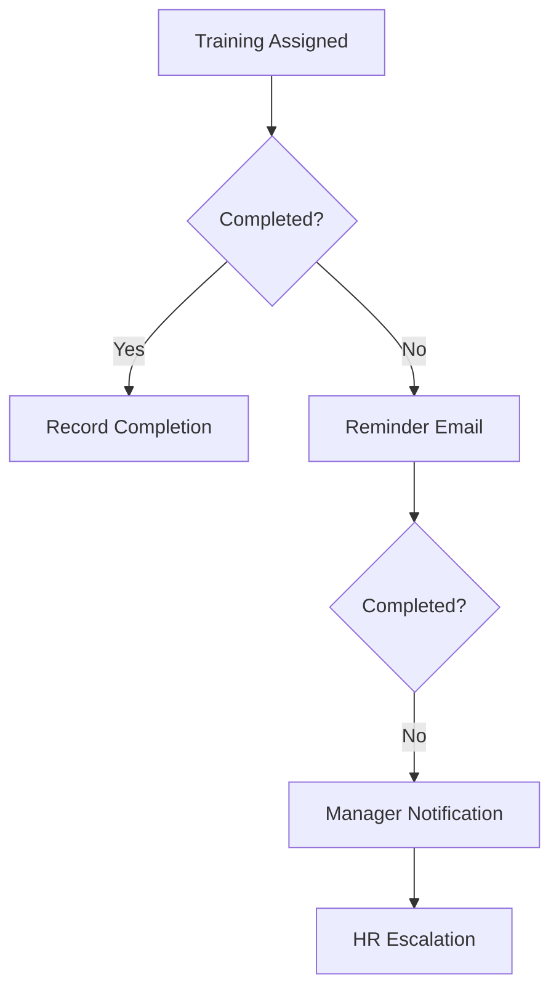

---

# Kirkpatrick Evaluation Scorecard

| Level   | Evaluation Focus | Metric Target                                 |
| ------- | ---------------- | --------------------------------------------- |
| Level 1 | Reaction         | 90% positive feedback                         |
| Level 2 | Learning         | 85%+ quiz score                               |
| Level 3 | Behavior         | Click rate below 5%, reporting above 60%      |
| Level 4 | Results          | Fewer phishing incidents and reduced downtime |

---

# Review Questions

### 1.

The Analysis phase finds the real problem. Here it was fear of getting blamed. Training should promote quick reporting, not just phishing knowledge.

---

### 2.

Objective B is better because it is measurable, practical, and tests real behaviour. Objective A only checks knowledge.

---

### 3.

Healthcare staff are busy. A 10-minute module is easier to finish, easier to remember, and causes less disruption.

---

### 4(a)

Employees learned the theory but didn't change their behaviour. The training isn't realistic enough.

---

### 4(b)

Use more phishing simulations, real email examples, hands-on reporting practice, and scenario-based exercises.

---

# References
- AI Usage Information
	- Used AI to generate the quiz
	- AI Usage to convert word flowchart into mermaid Diagrams
	- Table Generation in Step 1 Section
- Training PPT Attached in the assignment submission
###### Information
- date: 2026.08.06
- time: 11:07