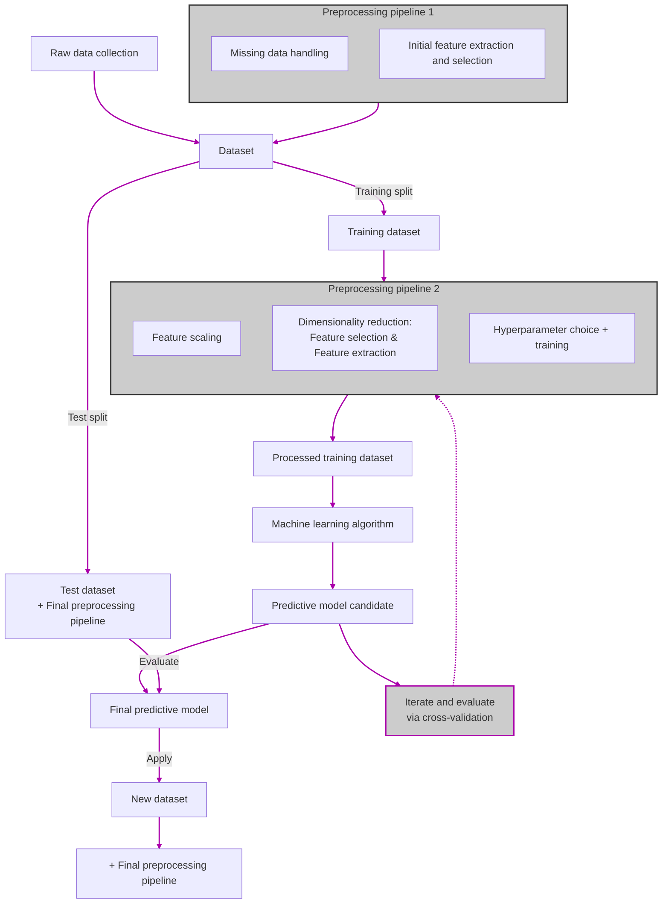

# Roadmap to build a Model

```mermaid
flowchart TD

    %% Nodes
    A[Raw data collection] --> B[Dataset]

    %% Preprocessing pipeline 1
    subgraph P1["Preprocessing pipeline 1"]
        direction TB
        P1a[Missing data handling]
        P1b[Initial feature extraction and selection]
    end
    style P1 fill:#ccc,stroke:#333,stroke-width:2px

    P1 --> B

    B -->|Training split| C[Training dataset]
    B -->|Test split| T[Test dataset\n+ Final preprocessing pipeline]

    %% Preprocessing pipeline 2
    subgraph P2["Preprocessing pipeline 2"]
        direction TB
        P2a[Feature scaling]
        P2b[Dimensionality reduction:\nFeature selection & Feature extraction]
        P2c[Hyperparameter choice + training]
    end
    style P2 fill:#ccc,stroke:#333,stroke-width:2px

    C --> P2 --> D[Processed training dataset]

    D --> E[Machine learning algorithm]
    E --> F[Predictive model candidate]
    F --> G[Final predictive model]

    %% Cross-validation loop
    F --> CV[Iterate and evaluate\nvia cross-validation]
    CV -.-> P2
    style CV fill:#ccc,stroke:#a0a,stroke-width:2px

    %% Evaluation
    T -->|Evaluate| G

    %% Application
    G -->|Apply| N[New dataset]
    N --> NP[+ Final preprocessing pipeline]

    %% Styling arrows
    linkStyle default stroke:#a0a,stroke-width:2px

```
# References

###### Information
- date: 2025.08.26
- time: 16:52