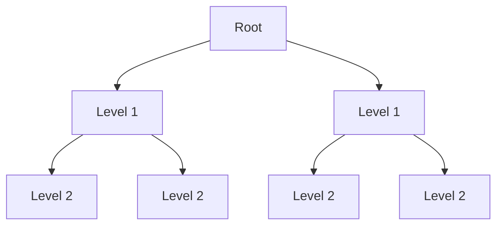
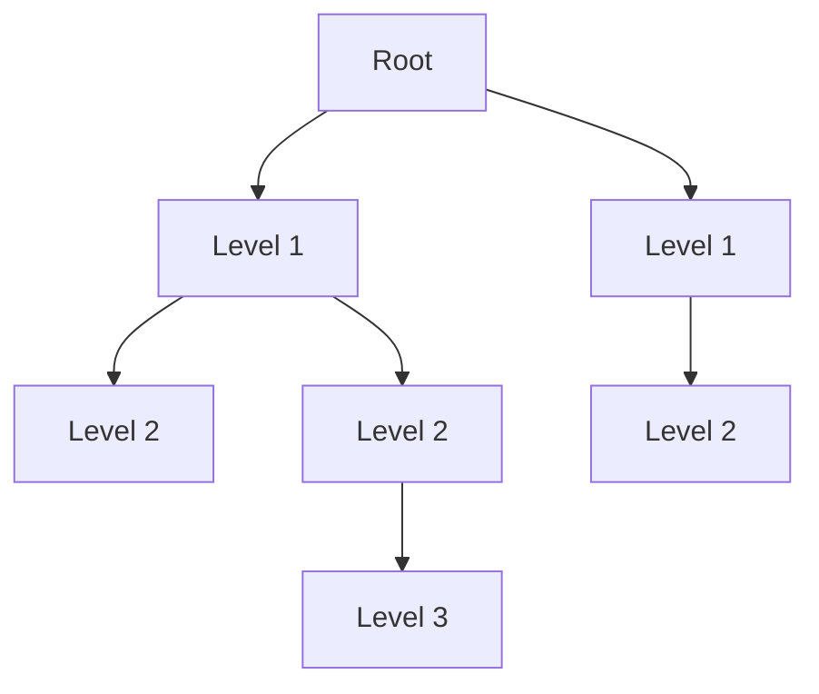

# Decision Tree

## Overview

* Decision Trees are used for both **regression** and **classification** tasks.
* They handle non-categorical data by transforming it into groups:
  * **Bins**: Continuous values grouped into intervals.
  * **Slabs**: Similar to bins, but often with an ordered or hierarchical meaning.

---

## Types of Decision Tree Algorithms

* **ID3**
  * Uses **information gain** for splitting.

* **C4.5**
  * Extension of ID3.
  * Handles **continuous attributes** and **missing values**.

* **CART**
  * Works for both classification and regression.
  * Uses **Gini impurity** or **MSE** for splits.

* **Random Forest**
  * An ensemble of many decision trees.
  * Helps reduce **overfitting**.

---

## Problem Setup

* Dataset:   $D = {t_1, \dots, t_n}$, where each sample $t_i = <t_{i1}, \dots, t_{ih}>$.
* Attributes:   ${A_1, A_2, \dots, A_h}$.
* Classes:   ${C_1, \dots, C_m}$.

**Decision Tree Structure**

* **Internal nodes** → attributes.
* **Branches** → decisions (splits based on values).
* **Leaf nodes** → class labels (classification) or predicted values (regression).

---

## Key Challenges

* Choosing the splitting attribute
  * Use measures like **information gain**, **Gini impurity**, or **variance reduction**.
* Ordering of attributes
  * Prioritize attributes that maximize information gain or minimize impurity.
* Splits
  * **Binary splits** (CART) or **multi-way splits** (ID3, C4.5).
* Tree structure
  * Depth and breadth need to be balanced to avoid underfitting or overfitting.
* Stopping criteria
  * Stop when a split no longer improves prediction quality.
  * Configurable using maximum depth, minimum samples per split, or impurity threshold.
* Training data
  * Must be representative of the real-world distribution to avoid bias.
* Pruning
  * Cutting unnecessary branches reduces noise and overfitting.

---

## Stopping Criteria

* The larger the number of features, the more splits are possible, leading to very deep trees.
* Too many splits can cause overfitting — the model becomes like a **bonsai tree**, fitting every detail of the training data but failing to generalize.

How to decide when to stop:

* Consider the number of samples in a node.
* Apply configuration limits:
  * Maximum depth.
  * Minimum number of samples per split.
  * Minimum number of samples in a leaf.
* Use hyperparameter tuning to balance underfitting and overfitting.

---

## Balanced vs. Imbalanced Trees

### Balanced Trees

* All leaves are at the same depth.
* Advantages
  * Generalize better, less prone to overfitting.
  * Faster predictions (every path has the same length).
* Disadvantages
  * May underfit if depth is set too shallow.

### Imbalanced Trees

* Leaves are at different depths.
* Advantages
  * Can model complex and rare cases with deeper branches.
* Disadvantages
  * Higher risk of overfitting.
  * Slower predictions (different path lengths).

---

## Issues with Decision Trees

* Overfitting
  * Tree grows too deep and memorizes the training data.
* Instability
  * Small changes in data can lead to a very different tree.
* Biased splits
  * Attributes with many distinct values tend to dominate splits.
* High variance
  * Performance fluctuates depending on training data.

---

## How to Solve These Issues

* Pruning
  * Cut unnecessary branches after training.
* Limiting depth
  * Restrict maximum depth and minimum samples per split.
* Ensemble methods
  * Use **Random Forests** or **Gradient Boosted Trees** to stabilize results.
* Feature engineering
  * Reduce noisy or irrelevant features before training.
* Cross-validation
  * Tune hyperparameters using validation data to avoid overfitting.

---

## What Kind of Datasets Work Well with ID3

* Datasets with **categorical attributes** (ID3 works best with discrete values).
* Situations where interpretability and simplicity are important.
* Moderate-sized datasets where building a single tree is feasible.

### Examples

* Medical diagnosis datasets with attributes like symptoms (fever: yes/no, cough: yes/no).
* Student performance classification (study_hours: low/medium/high, attendance: good/poor).
* Market segmentation (age_group, income_range, product_preference).
* Weather prediction (outlook: sunny/overcast/rain, humidity: high/low).

---
## References
**Date**: 2025.09.11 
- **Time**: 12:46 