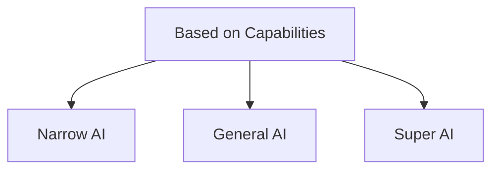
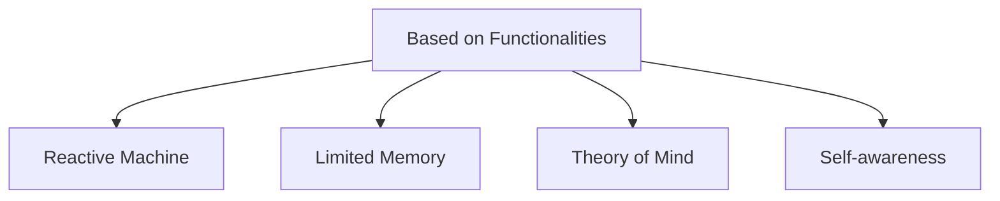

# AI and ML Studies Overview

## Core Technologies and Concepts

### Natural Language Processing (NLP)
- **Description**: Pairs computer processing with textual data.
- **Applications**: AI Chatbots, Transformer Models.

### AI Chatbots
- **Technologies Used**: Utilize NLP, Transformer Models.
- **Training**: Generative Pre-training.

### Deep Learning and Transformer Architecture
- **Key Concept**: Reinforcement Learning with Human Feedback (RLHF).
- **Models**: Sequential Models, Transformer-Based Models.

### Generative AI
- **Core Role**: Central advancement for most AI companies.
- **Capabilities**: Generate new data including video, images, and audio.

### Quantum AI
- **Description**: Uses quantum computing to enhance AI performance for very complex problems.
- **Applications**: Drug discovery.

## AI Development and Engineering

### Prompt Engineering
- **Importance**: Requires good prompts for better answers.
- **Challenges**:
  - May not always be correct; trained to provide human-like answers.
  - Struggles with sarcasm and irony.
  - Requires significant computing power.
  - Example: StackOverflow bans ChatGPT-generated content.

### Hybrid AI
- **Objectives**: Combines Symbolic (rule-based) AI with data-driven AI.
- **Balance**: Reasoning with learning patterns.
- **Example**: Different states may present different symptoms based on regional traits.

### Adaptive AI
- **Description**: Adjusts to changing environments or data inputs to improve performance and adapt over time.

### Conversational AI
- **Description**: Focuses on enabling machines to engage in human-like dialogue.
- **Applications**: Chatbots, virtual assistants.

## Ethical and Advanced AI

### Explainable AI (XAI)
- **Objective**: Decisions understandable to humans.
- **Necessity**: AI can hallucinate; justification needed for every decision made by XAI.

### Ethical AI / Responsible AI
- **Ensures AI is**:
  - Transparent
  - Fair
  - Safe
  - Respects Privacy
  - Aligns with Human Values

### Affective AI
- **Description**: Recognizes subtle human conversational cues such as facial expressions, voice tones, text sentiment.
- **Example**: ChatGPT's voice speech conversation.
- **Research Area**: Good area to start research on.

## Types of AI

### Based on Capabilities

- **Weak AI (Narrow AI)**
  - **Goal-Oriented**: Focuses on a single task.
  - **Example**: Recommendation Systems.

- **Strong AI**
  - **Human Intelligence**: Ability to learn, understand, and act indistinguishably from humans.
  - **Capabilities**: Can think, strategize, and perform multiple tasks.
  - **Example**: China's Tianhe-2 supercomputer with 33.86 Petaflops.

- **Artificial Superintelligence**
  - **Hypothetical AI**: Machines surpassing human intelligence.
  - **Characteristics**: Enhanced problem-solving and decision-making capabilities.

### Based on Functionality

- **Reactive AI**
  - **Fundamental**: Provides immediate responses without memory.
  - **Stimuli-Based**: Responds to immediate inputs.
  - **Example**: Email spam filters, recent click suggestions. Deep Blue chess.
- **Limited Memory**
	- **Short term memory:** Has some memory but not significant
- **Theory of Mind**
	- **Emotion based thinking:** Reads emotion and predicts future actions
		- Negotiation
- **Self Aware**

This structure should help in understanding the key concepts and types in AI and ML studies more clearly.