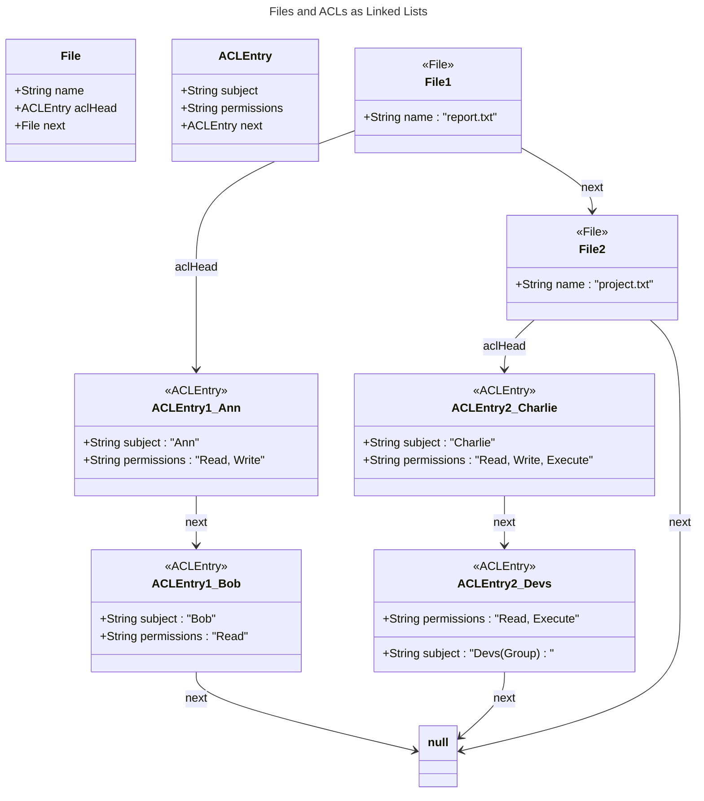
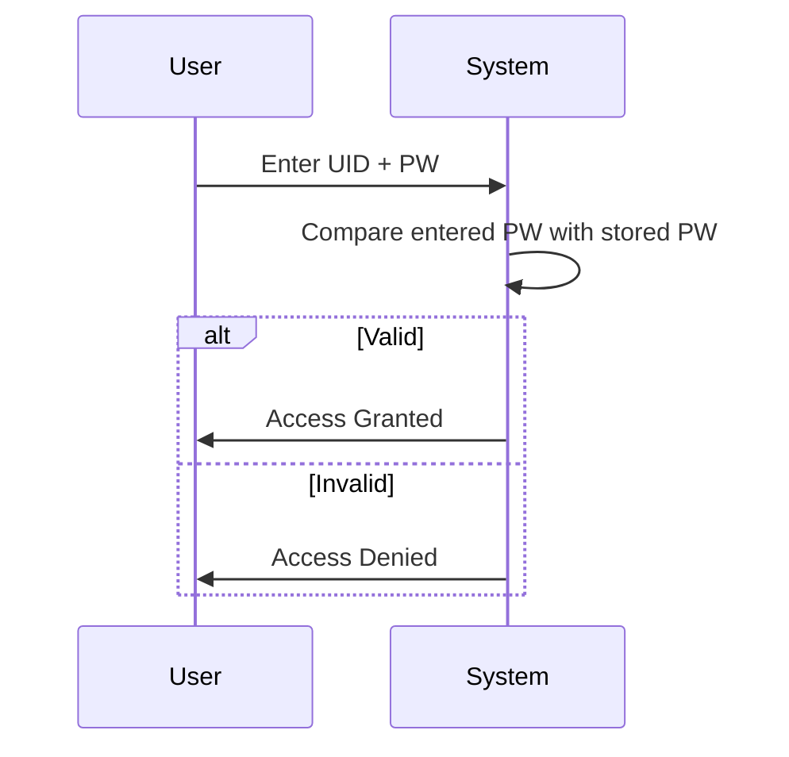
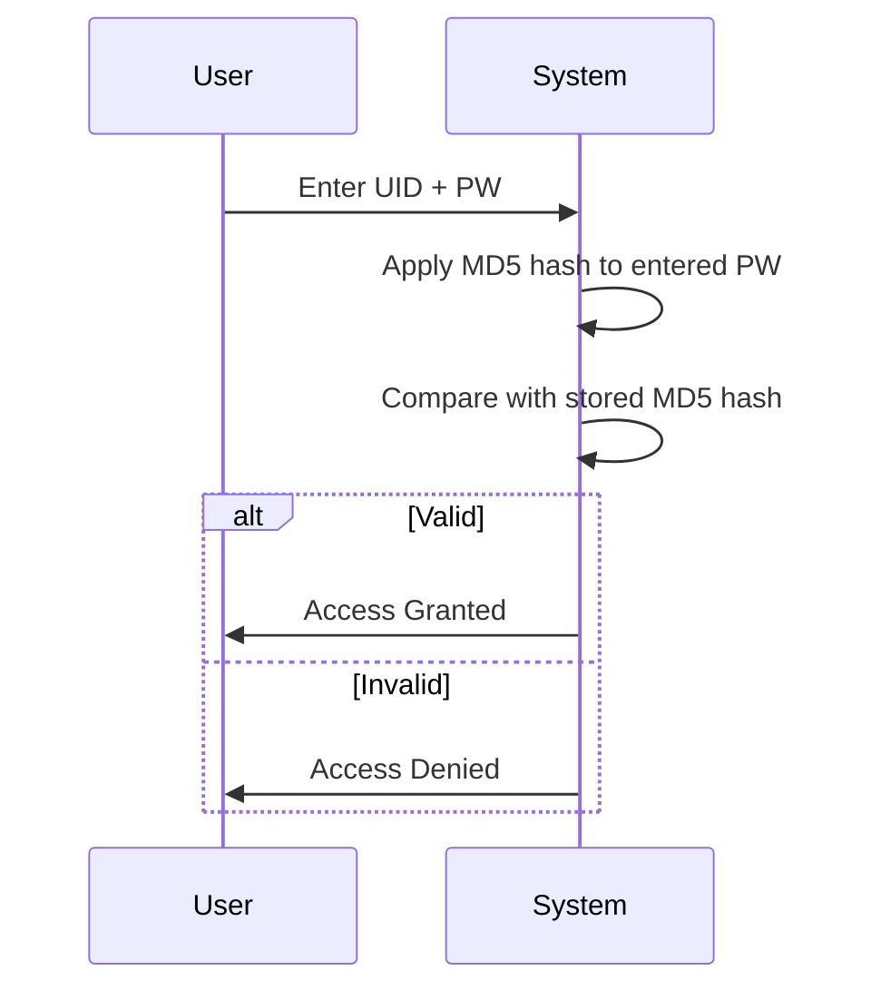

# Access Control
**Access Control in Cybersecurity**
Access control ensures that only authorized users can enter a system or resource. It works by applying multiple layers of checks, similar to how our college controls entry:

* **Security Guard (Presence of ID card)** → *Basic check: Do you even have an account/credential?*
* **ID Tap at the Gate** → *Authentication step: Verifying your digital ID (username + password / card scan).*
* **Fingerprint Scan** → *Strong authentication: biometric factor to confirm you are the real owner.*

Just like these steps prevent outsiders from entering the college, layered access control in cybersecurity prevents unauthorized users from entering systems.

## **Access Control: Definitions and Concepts**

## **1. Subject**
- **Definition:** An active entity that **requests access** to objects.
- **Role:** Can **control or manipulate** objects (e.g., read, write, delete).
- **Examples:**
  - Users
  - Processes
  - Programs

---

## **2. Object**
- **Definition:** A passive entity that **contains or receives information**.
- **Examples:**
  - Files
  - Databases
  - Printers
  - Network resources

---

## **3. Security Policy**
- **Definition:** A set of **high-level rules** that define **who can access what** and **under what conditions**.
- **Purpose:** Ensures **confidentiality, integrity, and availability** of objects.

### **Three Main Categories of Access Control Policies:**

#### **A. Discretionary Access Control (DAC)**
- **Definition:** Access is **controlled by the owner** of the object.
  - Owners can **grant or revoke** permissions to other subjects.
- **Example:**
  - When a user creates a file, they **own it** and can set permissions for others.
- **Model:**
  - **Access Matrix Model:**
    - Represents subjects (rows) and objects (columns).
    - Each cell defines the **access rights** (e.g., read, write, execute).

| Policy Type             | Controlled By     | Flexibility | Security Level | Example Use Case               |
| ----------------------- | ----------------- | ----------- | -------------- | ------------------------------ |
| **Discretionary (DAC)** | Object owner      | High        | Low-Medium     | Personal files, shared folders |
| **Mandatory (MAC)**     | Central authority | Low         | High           | Military, government systems   |
| **Role-Based (RBAC)**   | Role assignments  | Medium      | Medium-High    | Enterprises, corporations      |

| Subject           | Object (File/Directory) | Read (R) | Write (W) | Execute (X) | Delete (D) | Notes                            |
| ----------------- | ----------------------- | -------- | --------- | ----------- | ---------- | -------------------------------- |
| **User: Alice**   | `/projects/report.txt`  | ✅ Yes    | ✅ Yes     | ❌ No        | ❌ No       | Owner of the file.               |
| **User: Bob**     | `/projects/report.txt`  | ✅ Yes    | ❌ No      | ❌ No        | ❌ No       | Can view but not modify.         |
| **Group: Devs**   | `/projects/report.txt`  | ✅ Yes    | ✅ Yes     | ❌ No        | ❌ No       | Collaborators on the project.    |
| **Group: Guests** | `/projects/report.txt`  | ✅ Yes    | ❌ No      | ❌ No        | ❌ No       | Read-only access.                |
| **User: Admin**   | `/projects/`            | ✅ Yes    | ✅ Yes     | ✅ Yes       | ✅ Yes      | Full control over the directory. |
| **User: Eve**     | `/projects/report.txt`  | ❌ No     | ❌ No      | ❌ No        | ❌ No       | No access granted.               |
- **Pros:**
  - Flexible and easy to implement.
  - Aligns with real-world ownership (e.g., personal files).
- **Cons:**
  - **Permission propagation issues:**
    - If **User A** shares a file with **User B**, and **User B** shares it further, **User A cannot revoke access** for those downstream users.
    - **No centralized control** : owners manage permissions independently.
  - **Potential for unauthorized access** if owners are careless.

---

#### **B. Mandatory Access Control (MAC)**
- **Definition:** Access is **controlled by a central authority** (e.g., system administrator or OS).
  - Uses **security labels** (e.g., classified, secret, top-secret) for subjects and objects.
  - Subjects can only access objects if their **clearance level matches or exceeds** the object's label.
- **Example:**
  - Military or government systems where **data classification** is critical.
- **Pros:**
  - **High security** : prevents unauthorized access even if owners are compromised.
  - **Centralized control**: policies are enforced uniformly.
- **Cons:**
  - **Inflexible**: users cannot override policies.
  - **Complex to manage** : requires careful labeling and administration.

---

#### **C. Role-Based Access Control (RBAC)**
- **Definition:** Access is **based on job roles** within an organization.
  - Permissions are **assigned to roles**, and users are **assigned to roles**.
- **Example:**
  - A "Manager" role might have access to financial reports, while a "Developer" role has access to code repositories.
- **Pros:**
  - **Simplifies administration** : permissions are managed by role, not individually.
  - **Scalable** : easy to add/remove users as roles change.
- **Cons:**
  - **Role explosion** : too many roles can become complex.
  - **Not granular** : may not fit all access needs.

---

## **4. Security Model**
- **Definition:** A **formal representation** of a security policy.
  - Describes **how subjects, objects, and access rights interact**.
- **Purpose:**
  - Allows **mathematical proof** of security properties.
  - Helps **design and verify** access control systems.
- **Examples:**
  - **Bell-LaPadula Model** (for confidentiality).
	  - 
  - **Biba Model** (for integrity).
  - **Clark-Wilson Model** (for commercial integrity).

#### Bell LaPadula Model
- Applications
	- Gvmt
	- Military
- Focuses on data confidentiality
- Properties
	- No read up.
		- A subject at lower security level shallnt have access to higher level
	- No write down
		- A subject at a higher security level shall not write at a lower level to prevent read and copy execution to destroy confidentiality.
	- Strong \* Property
		- Write permission is available only on the **same level**.
	- Tranquility Principle
		- Security Levels does not change during operation
		- Security levels do not change in a way that violates the rules of a given security policy
	- 

---

## **5. Security Mechanism**
- **Definition:** The **low-level functions** (hardware/software) that **enforce** the security policy and model.
- **Purpose:** Implements the **controls** defined by the policy.
- **Examples:**
  - **Authentication systems** (passwords, biometrics, tokens).
  - **Encryption** (AES, RSA).
  - **Access control lists (ACLs)**.
  - **Firewalls and intrusion detection systems (IDS)**.

---
## **Summary Table**

| Policy Type               | Controlled By          | Flexibility | Security Level | Example Use Case          |
|---------------------------|------------------------|--------------|----------------|---------------------------|
| **Discretionary (DAC)**   | Object owner           | High         | Low-Medium     | Personal files, shared folders |
| **Mandatory (MAC)**       | Central authority      | Low          | High           | Military, government systems |
| **Role-Based (RBAC)**     | Role assignments       | Medium       | Medium-High    | Enterprises, corporations |

---

## **Key Takeaways**
1. **DAC** is user-friendly but lacks centralized control.
2. **MAC** is highly secure but rigid and complex.
3. **RBAC** strikes a balance between flexibility and security.
4. **Security models** formalize policies for verification.
5. **Security mechanisms** enforce policies in real-world systems.
## Factors of authentication

## **ACFLS in Access Control**
1. **Authentication (A)**
   * Verifying the identity of the user (e.g., password, ID, biometrics).
2. **Comp / Authorization (C)**
   * Granting or denying permissions to resources based on user identity.
3. **Function (F)**
   * The operations a user can perform once authorized (read, write, execute, delete).
4. **Logical Authentication (L)**
   * System-based verification mechanism that validates identity (credentials, hashes, tokens, biometrics).
5. **Selection (S)**
   * Choosing or modifying who can access or change information in the authorization or control system (e.g., password reset, role assignment).
### **Example**
**Passwords**
* **A (Authentication)** → User enters password to prove identity.
* **C (Comp / Authorization)** → System checks what the authenticated user is allowed to access.
* **F (Function)** → User is permitted to perform operations like reading their data.
* **L (Logical Authentication)** → Password compared with stored hash to verify identity.
* **S (Selection)** → Admin or user changes the password or updates access rights.

**Fingerprints**

# Passwords
## Clear Text Password
- Prompt for **UID** and **PW**  
- User enters credentials  
- System validates **UID** and **PW** directly against stored values  
- Authentication result is given (success or failure)  
- **Drawbacks:** Passwords stored in plain text are insecure, easily intercepted, and can be misused if exposed

## MD5 Hashed Password
* Prompt for **UID** and **PW**
* User enters credentials
* System applies MD5 hash to entered PW
* Compare result with stored MD5 hash of PW
* Authentication result is given (success or failure)
* **Drawbacks:** Vulnerable to **replay attacks** since the same hash is sent every time, allowing attackers to reuse captured hashes

## MD5 Hashed Password with Nonce
* Prompt for **UID** and **PW**
* Server generates a random **nonce** and sends it to the user
* User enters credentials
* Client applies **MD5(PW + nonce)**
* Client sends **UID + hashed(PW + nonce)** to server
* Server computes the same hash using stored PW and nonce
* Compare results
* Authentication result is given (success or failure)
* **Advantage:** Nonce changes each time, so no fixed hash is exposed; prevents replay attacks

# Attacks on P/W
## Dictionary Attacks
- Trial and error with a list of potential passwords
		- Crack, John The Ripper

## Privileges 
- Role based access controls
# References

###### Information
- date: 2025.09.02
- time: 15:05