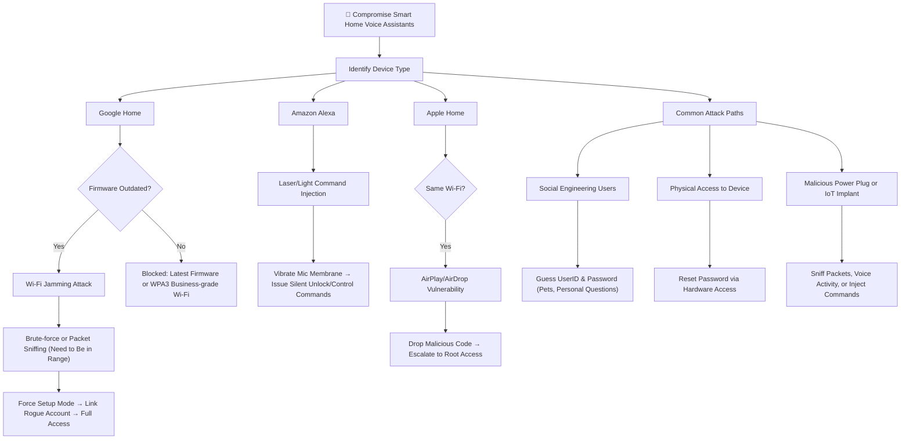

# Cybersecurity Fundamentals Lab 1

###### Details
Roll Number : K057
Name : Tejas Kamal Sahoo
Branch : Btech Cyber Security
Year : 3rd
Semester : 5th
Date & Time : 15-07-2025 10:56

### Questions

1. What role do attack trees play in cybersecurity audits and compliance efforts (e.g., ISO 27001, NIST)?
	 The International Standard for Organization helps set a bare minimum for security & organization compliance. Similarly The National Institute of Standards and Technology is an American association that helps set a base for companies so they innovate easily. Many frameworks (ISO 27001, SOC 2, PCI DSS) require **documented risk assessments**. Attack trees serve as clear, auditable artifacts to demonstrate **due diligence** in identifying and mitigating threats. 
	 
	 To begin with they clear out all the basic attacks that script kiddies / beginner hackers would be able to execute. Since the population of beginner hackers is high it helps reduce risk by lot. 
	 To complete they also help one to combat experienced hackers by.
	 - Spreading awareness in employees with the help of compliance required courses for security
	 - Mandatory of encryption of data
	 - Continuous Code checking for vulnerabilities.
	   
	   
2. Compare attack trees with fault trees. How do their purposes and logic structures differ in cybersecurity risk analysis?
	The difference between attack trees and fault trees can be said by the basis of how the fault was used. If due to  then one could say that it is a fault within the company/entity.
	 - If the fault occurs due to accidental, unintentional, or internal system issues (e.g., hardware failure, software bug, human error), then one could say that it is a fault within the company/entity, and it is best analyzed using a fault tree.
	
	- If the fault is intentionally exploited or caused by an external adversary (e.g., phishing, malware injection, deliberate sabotage), then one could say that it is an attack against the company/entity, and it is best modeled using an attack tree.
	  
	- One helps us mitigate accidents due to self negligence ( Fault trees ) other helps us mitigate self negligence **AND** threats from outside.
	
3. Suppose you are a security analyst. How would you use attack trees to assess and prioritize vulnerabilities in a cloud-based system?
   To begin with I would identify vulnerabilities like these:
	- Accidentally pushing env files to github.
	- Getting access to server ssh keys.
	- Api's vulnerable for sql injection.
	  etc.
	Then I would prevent label them with attractiveness weights and then on the basis of weights I would patch these by spreading awareness among employees for github. Storing ssh keys securely. Designing API Keys Properly. etc

4. How can attack trees support decision-making for applying countermeasures?
   Attack trees make it very clear **where and how to place defenses** because they break down every possible attack path step by step.
	- First, they help you see **which small fix can block multiple attack branches**. For example, enforcing strong IAM rules or MFA might cut off 3–4 attack paths at once, making it a cost-effective decision.
	- Second, they help with **priority setting**. By marking which branches are easiest for attackers (low effort, high impact), you can focus resources there first instead of wasting time on rare attacks.
	- Third, they make **compliance & audits easier** because you can literally show which controls are mapped to which attack path – this fits well with ISO 27001 and NIST requirements for risk treatment.
	- Lastly, they are good for **employee awareness & training**. Showing the attack tree in training makes staff understand how their actions (like clicking phishing links) open up attack paths, so they follow security rules seriously.
5. Explain how attack trees help in identifying the most probable attack path. What metrics can be associated with each node to support this analysis?
	 Attack trees make it easy to find **which attack path an attacker is most likely to use** because you can score each step (node) and then compare complete paths.
	- **How it works:**  
	    You break the attack into branches and assign metrics to each node. Then you add up or calculate which path needs the **least effort but gives the highest impact**, because attackers always go for the easiest and most rewarding option.
	- **Common Metrics for Each Node:**
	    - **Effort / Cost:** How hard or expensive it is for the attacker (lower = more likely).
	    - **Probability of Success:** Based on how commonly this exploit works in the wild.
	    - **Impact:** What damage it causes if successful (data theft, financial loss).
	    - **Detectability:** If it’s hard to detect, attackers will prefer it.
# References
- [Apple Airplay Vulnerability](https://www.youtube.com/watch?v=vcs5G4JWab8w)
- [Apple Airplay Vulnerability Airborne](https://www.oligo.security/blog/airborne)
- 

###### Information
- date: 2025.07.15
- time: 10:56