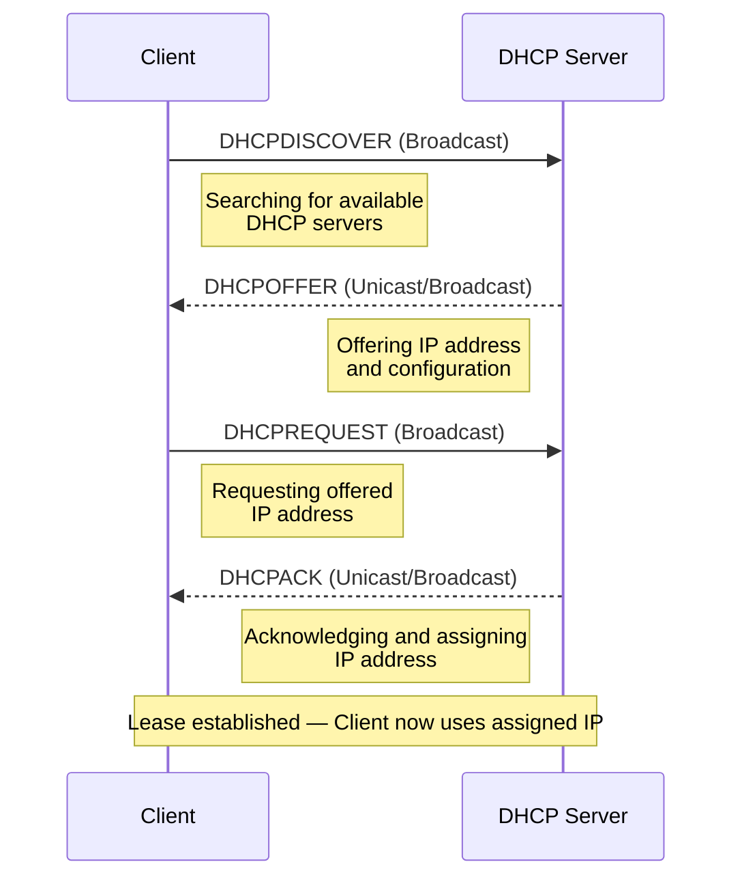

# Cybersecurity Lab 3

## Aim
To study and simulate DHCP starvation layer 2 attack using packet tracer

## Theoretical Explanation of DHCP Starvation
* **Definition**:
  * DHCP Starvation is an attack where an attacker broadcasts a large number of DHCP requests with **spoofed MAC addresses** simultaneously.
* **Tools**:
  * Can be easily carried out using tools such as **Gobbler**.
* **Effect on Network**:
  * Flooding the DHCP server with requests can **exhaust the address space** allocated by the DHCP server.
  * This leaves **legitimate clients without IP addresses**, effectively **denying network access** (Denial of Service).
* **Post-attack Exploitation**:
  * Attacker may set up a **Rogue DHCP Server**.
  * Possible follow-up attacks include:
    * **Man-in-the-Middle (MITM)** attacks.
    * Setting their machine as the **default gateway** and **sniffing packets**.
* **Note**:
  * Exhausting DHCP addresses can make a Rogue DHCP Server more effective, but **it is not mandatory** for deploying one.
* **Illustration**:
  * Figure shows an example of a DHCP attack scenario.
![[IMG-20260420201420691.png|center]]

![[IMG-20260420201420713.png|center]]

## **Topology and Labwork**
We first create the basic topology for the lab. It consists of one router and a switch that then is connected to four other computers. 
#### Connections and assigning IP's 
We now Configure the IP and Subnet for the router. 
- Our current **Subnet** is 255.255.255.252 that means we have $2^n - 2$ Host IPS Available. 
- That Means 6 IP's are available. 
We already have four computers set up in the network so we got 2 more mac addresses to spoof and exhaust the DHCP Configuration.

![[IMG-20260420201420861.png|center]]

After creating this topology we configure the IP and subnet for the switch.

![[IMG-20260420201421143.png|center]]

Then we Configure the DHCP for our router and let it know the Router Ip address and the subnet so it can start dynamically appoint IP's to devices.

![[IMG-20260420201421431.png|center]]

## Now we exhaust the DHCP
We will now change the mac address of the any one computer twice. This achieves the following:;
- Take the rest of the 2 available IP's
- DHCP is out of IP's to provide to the devices.
This is a big vulnerability as a new device can just connect to the network if they have physical access and then create a new DHCP Server and start assigning IP and start routing the network via that router itself.

That is exactly what we will do. We add a rogue router in the network and then make start providing the DHCP Service.

### Observation
It is easy to DHCP Starve access points to create vulnerability. We can do the following to create a safer mechanism:
- DHCP Snooping : Creating a trust network of ports
- Login Pages : 
	- Give one user a fixed amount of mac leases.

## Questions and answers
1. What is the purpose of DHCP server in a network?
	1. It's used to assign IP  Configurations to the hosts in the network. 
	2. It is a service to automate the process of IP Assigning to reduce configuration errors.
2. Explain the working of DHCP

3. What is DoS attack? Is DHCP starvation attack a kind of DoS attack?
	1. DoS attack stands for Denial of Service.
	2. By starving the DHCP from IP's to provide we basically make the network run out of IP.
	3. Thus we have denied service and this indeed is a DoS attack.
4. What are counter measures available to prevent DHCP starvation attack?
	- DHCP Snooping : Creating a trust network of ports
	- Login Pages : 
		- Give one user a fixed amount of mac leases.
5. What is Rogue DHCP Server attack?
	- A router starts providing IP's in a network where there are no more IP addresses available to be dynamically provided.
	- This router now can intercept packets that are routed through itself.
6.  What are counter measures available for Rogue DCHP server attack?
	- We can setup WPA Enterprise for such networks.
	- With Each username we can limit the number of devices/mac addresses that can be connected at one time in the network.
	- We configure Raid Server with the above configuration. If properly done and passwords are not shared attacker will be limited to only 5 IP's.
# References

###### Information
- date: 2025.08.12
- time: 10:14