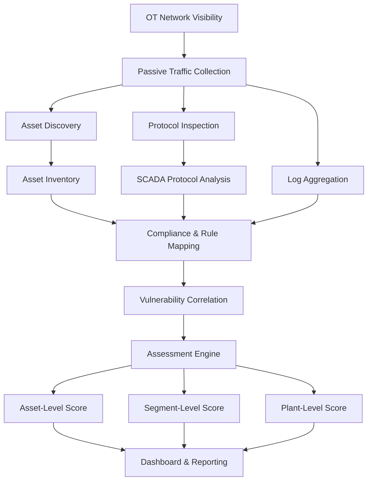

# Proposed Capstone Project Synopsis

## OT/SCADA Cyber Security Posture Monitoring & Compliance Scoring Platform for Power Infrastructure

---

# 1. Objective

The objective of this project is to develop a centralized OT cyber security posture assessment and compliance monitoring platform aligned with Indian power-sector cyber security guidelines and industrial security standards.

The proposed system is intended to assist in:

* Continuous OT/SCADA asset visibility
* Compliance validation against applicable guidelines
* Vulnerability and exposure identification
* Asset inventory and unauthorized device detection
* Security posture scoring
* Centralized monitoring and reporting

The platform is envisioned as a passive monitoring and assessment system suitable for industrial OT environments where operational continuity and non-intrusive monitoring are critical.

---

# 2. Proposed Approach

The project is planned as a phased implementation focused on:

1. Asset discovery and OT network understanding
2. Guideline mapping and assessment methodology definition
3. Vulnerability identification methodology
4. Device and network assessment
5. Scoring and compliance evaluation
6. Reporting and visualization

---

# 3. Phase-Wise Plan of Action

---

## Phase 1 — Asset Discovery & Network Visibility

### Objective

Establish visibility into the OT environment and maintain a continuously updated asset inventory.

### Scope

* Passive OT asset discovery
* Network traffic observation
* Asset classification
* Detection of unknown or unauthorized devices
* Inventory maintenance

### Expected Output

* Live rolling asset database
* Device categorization
* Vendor and protocol identification
* Network communication mapping
* Asset baseline generation

### Proposed Techniques

* Passive packet inspection
* SPAN/TAP-based monitoring
* MAC/IP correlation
* Protocol fingerprinting
* Vendor/OUI mapping

### Target Assets

* PLCs
* RTUs
* HMIs
* SCADA servers
* Historians
* Engineering workstations
* Firewalls
* Industrial switches

---

## Phase 2 — Guideline Mapping & Assessment Methodology

### Objective

Translate applicable cyber security guidelines into measurable technical controls and checkpoints.

### Proposed Guideline Mapping

* CEA Cyber Security Guidelines
* CERT-In directives
* NCIIPC recommendations
* IEC 62443
* NIST SP 800-82

### Activities

* Identification of measurable controls
* Categorization of assessable vs non-assessable controls
* Definition of validation methodology for each checkpoint
* Definition of evidence collection mechanisms

### Example Categories

* Asset visibility
* Network segmentation
* Access control
* Logging and monitoring
* Patch/version management
* Vulnerability management
* Remote access security
* Protocol security

### Expected Output

* Structured compliance checklist
* Technical assessment methodology
* Control-to-validation mapping

---

## Phase 3 — Vulnerability Identification Methodology

### Objective

Define methodologies for identifying vulnerabilities and security weaknesses in OT assets and communications.

### Proposed Scope

#### Passive Assessment

* Firmware/version analysis
* Configuration analysis
* Traffic inspection
* Exposure analysis
* Protocol analysis

#### Controlled/Restricted Assessment

(To be validated depending on environment constraints)

* Active scanning
* Service enumeration
* Targeted validation testing

### Proposed Analysis Areas

* Known CVEs
* Unsupported firmware/software
* Weak configurations
* Unauthorized services
* Insecure communication patterns
* Protocol misuse/anomalies

### Data Sources

* NVD
* Vendor advisories
* CVE databases
* ICS-CERT advisories

### Expected Output

* Vulnerability identification framework
* Risk categorization methodology
* Exposure assessment workflow

---

## Phase 4 — Assessment Engine

### Objective

Evaluate discovered entities against defined controls and methodologies.

### Assessment Categories

* Asset control
* Endpoint/network security
* Configuration posture
* Version/patch posture
* Vulnerability exposure
* Logging visibility
* SCADA protocol security

### Additional Considerations

If a device, protocol, or environment cannot be reliably assessed due to:

* Vendor limitations
* Proprietary systems
* Encrypted traffic
* Air-gapped constraints
* Visibility limitations

the system will:

* Flag the entity
* Mark assessment confidence level
* Identify assessment gaps

### Expected Output

* Entity-level assessment results
* Visibility gaps
* Assessment confidence indicators

---

## Phase 5 — Security Scoring & Compliance Engine

### Objective

Develop a weighted scoring methodology for evaluating security posture and compliance status.

### Proposed Scoring Levels

* Asset-level score
* Segment-level score
* Plant-level cumulative score
* Guideline-specific compliance score

### Proposed Inputs

* Asset visibility status
* Vulnerability exposure
* Configuration posture
* Network behavior
* Logging coverage
* Segmentation controls
* Protocol security observations

### Sample Scoring Areas

| Category                | Weight |
| ----------------------- | ------ |
| Asset Visibility        | 20     |
| Vulnerability Exposure  | 20     |
| Configuration Security  | 15     |
| Network Security        | 15     |
| Logging & Monitoring    | 10     |
| SCADA Protocol Security | 10     |
| Compliance Coverage     | 10     |

### Expected Output

* Security posture score
* Compliance percentage
* Risk classification
* Prioritized findings
* Cumulative OT security posture report

---

## Phase 6 — Reporting & Visualization

### Objective

Provide centralized operational visibility and reporting.

### Proposed Features

* Live asset inventory
* Compliance dashboard
* Security posture dashboard
* Vulnerability summaries
* Rogue asset alerts
* Risk heatmaps
* OT communication mapping

### Reporting

* Asset-wise assessment reports
* Guideline-wise compliance reports
* Network-level cumulative reports
* Risk summaries
* Exception reporting

---

# 4. Proposed Technical Direction

## Backend

* Python
* FastAPI

## Frontend

* React.js

## Database

* PostgreSQL

## Monitoring & Analysis

* Zeek
* Suricata
* Wireshark dissectors

## Logging & Visualization

* ELK Stack / Grafana Loki
* Grafana

## Deployment

* Docker-based deployment

---

# 5. Areas Requiring Discussion / Clarification

The following areas would require further discussion and validation based on actual plant environments and operational constraints:

* Permitted monitoring approaches
* Passive vs active assessment scope
* Access to SPAN/TAP ports
* Existing asset inventory availability
* Vendor/protocol constraints
* Logging infrastructure availability
* Segmentation architecture visibility
* Regulatory reporting expectations
* Air-gapped environment considerations
* Operational safety constraints

---

# 6. Proposed Workflow Diagram

---

# 7. Expected Outcome

The proposed system is intended to function as a centralized OT cyber security posture and compliance monitoring platform capable of:

* Continuous asset visibility
* Unauthorized asset detection
* Guideline-based compliance assessment
* OT vulnerability visibility
* Protocol-level monitoring
* Security posture scoring
* Centralized operational reporting
