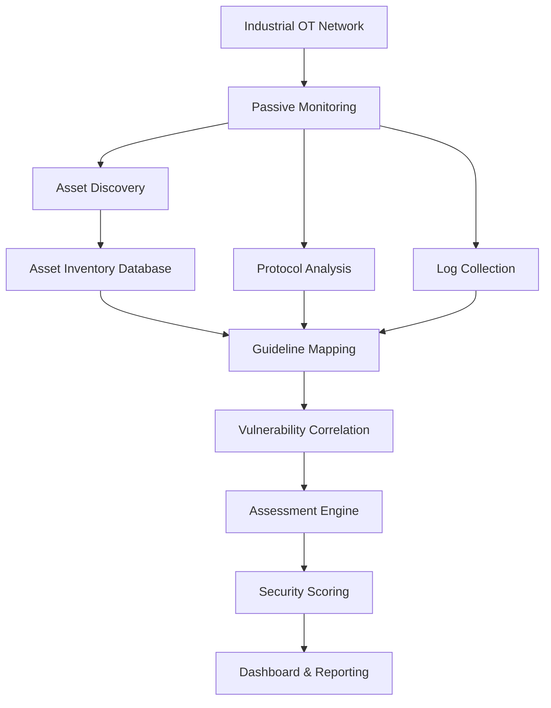

---

Title: "Understand the project AB"

Status:

marker:

tags:

Date: "2026.05.30"

Time: "00:41"

---
# Understand the project AB

This document is not intended to be a formal proposal.
**It is an internal understanding guide.**  
# Beginner Guide for Team Members

## OT/SCADA Cyber Security Posture Monitoring & Compliance Scoring Platform

---

# 1. Why This Document Exists

This document is intended for team members:

* Cyber security
* Industrial systems
* SCADA systems
* OT networks
* Power plant infrastructure
* Industrial protocols
* Compliance frameworks

The goal is to ensure every team member understands:

* What this project is
* Why it matters
* What technologies are involved
* What exactly we are building
* How the system will work
* What each phase means
* What problems we are solving

This document is not intended to be a formal proposal.
**It is an internal understanding guide.**

---

# 2. What Is This Project?

We are building a system that monitors industrial networks used in power plants and evaluates how secure they are.

The system will:

* Detect industrial devices on the network
* Understand what devices are connected
* Detect unauthorized devices
* Monitor communication traffic
* Check vulnerabilities
* Compare findings against cyber-security guidelines
* Generate security scores
* Create reports and dashboards

In simple words:

We are trying to create a “cyber-security health monitoring system” for industrial OT/SCADA environments.

---

# 3. What Is OT?

OT means:

Operational Technology

These are systems that control real-world industrial operations.

Examples:

* Power plants
* Factories
* Water treatment plants
* Oil & gas systems
* Substations
* Manufacturing units

Unlike normal IT systems:

IT systems process information.
OT systems control physical machines.

Examples:

| IT             | OT                  |
| -------------- | ------------------- |
| Email servers  | Turbine controllers |
| Office laptops | PLCs                |
| HR software    | SCADA systems       |
| Databases      | Industrial sensors  |

If an OT system fails:

* Machines may stop
* Electricity may fail
* Equipment may get damaged
* Human safety may be affected

This is why OT security is extremely important.

---

# 4. What Is SCADA?

SCADA stands for:

Supervisory Control And Data Acquisition

It is the central system used to:

* Monitor industrial operations
* Collect data from field devices
* Display information to operators
* Send commands to industrial equipment

Think of SCADA as:

"The brain/control center of industrial operations"

SCADA systems are used in:

* Power generation
* Transmission systems
* Water plants
* Refineries
* Factories

---

# 5. Important Industrial Components

To understand the project, we must understand the devices involved.

---

## 5.1 PLC (Programmable Logic Controller)

PLC = Industrial computer/controller.

Purpose:

Controls industrial machinery.

Examples:

* Turning pumps ON/OFF
* Opening valves
* Controlling turbines
* Controlling motors
* Managing automation logic

PLCs are extremely important.
If a PLC is compromised:

* Machines may behave incorrectly
* Industrial processes may fail
* Equipment may get damaged

Examples of vendors:

* Siemens
* Schneider
* ABB
* Rockwell
* Mitsubishi

---

## 5.2 RTU (Remote Terminal Unit)

RTUs are field communication devices.

Purpose:

* Collect sensor data
* Send telemetry to SCADA systems
* Operate remote equipment

Common in:

* Substations
* Remote industrial sites
* Grid monitoring

---

## 5.3 HMI (Human Machine Interface)

HMI is the interface operators use.

Purpose:

* Visualize plant operations
* Monitor alarms
* Control industrial equipment

Examples:

* Control room screens
* Industrial dashboards
* Touchscreen operator panels

HMIs are what humans interact with.

---

## 5.4 SCADA Server

The SCADA server acts as the central controller.

It:

* Collects information from PLCs/RTUs
* Stores operational data
* Sends commands
* Displays system status

Think of it as the command center.

---

## 5.5 Historian

Historian = Industrial database.

Purpose:

Stores historical operational data.

Example:

* Temperature logs
* Pressure logs
* Alarm history
* Machine activity

Used for:

* Analysis
* Troubleshooting
* Reporting
* Auditing

---

## 5.6 Engineering Workstation

This is a very sensitive system.

Purpose:

Used by engineers to:

* Configure PLCs
* Upload industrial logic
* Change configurations
* Modify automation behavior

If compromised:

An attacker may directly change industrial processes.

---

# 6. Difference Between IT Security and OT Security

OT security is very different from normal IT security.

---

## IT Security Goal

Protect:

* Data
* Accounts
* Applications
* Information

---

## OT Security Goal

Protect:

* Physical operations
* Human safety
* Industrial availability
* Critical infrastructure

---

## Example

In IT:

If a server restarts, it is usually manageable.

In OT:

If a PLC restarts:

* A plant may stop
* Equipment may fail
* Operations may become dangerous

This is why OT systems are sensitive.

---

# 7. Why This Project Matters

Government agencies issue cyber-security guidelines for power plants because:

* Power infrastructure is critical
* Cyber attacks can disrupt electricity
* Industrial attacks can cause physical damage
* OT systems are increasingly connected

Examples:

* Malware attacks
* Ransomware
* Rogue devices
* Insider threats
* Protocol manipulation

The problem:

Many organizations:

* Do not have complete visibility
* Do not know all devices connected
* Do not continuously monitor security posture
* Perform manual compliance checks

Our project attempts to solve this.

---

# 8. What Are We Actually Building?

We are building a centralized monitoring platform.

The system will:

1. Observe the OT network
2. Discover devices
3. Understand communications
4. Detect vulnerabilities
5. Compare findings with guidelines
6. Generate scores
7. Produce reports

Think of it like:

"A cyber-security control tower for industrial systems"

---

# 9. High-Level System Workflow

The project works in multiple phases.

---

# Phase 1 — Asset Discovery

This is the MOST IMPORTANT phase.

Before securing anything, we must know:

* What exists
* What devices are connected
* Which devices are expected
* Which devices are unauthorized

Without visibility:

Security is impossible.

---

## 9.1 What Is Asset Discovery?

Asset discovery means:

Finding devices connected to the industrial network.

Examples:

* PLCs
* RTUs
* HMIs
* SCADA servers
* Firewalls
* Engineering workstations
* Switches

---

## 9.2 How Will We Discover Devices?

We plan to use:

Passive monitoring.

This means:

We OBSERVE traffic.
We do NOT aggressively attack or scan devices.

This is important because industrial systems are sensitive.

---

## 9.3 Why Passive Monitoring?

Active scanning can:

* Crash devices
* Interrupt industrial operations
* Affect stability

Industrial environments prefer passive monitoring.

---

## 9.4 Methods of Discovery

Possible techniques:

* Packet capture
* SPAN ports
* Network TAPs
* MAC address analysis
* Vendor identification
* Protocol fingerprinting

---

## 9.5 Live Asset Database

We want a continuously updated inventory.

Meaning:

The system should:

* Continuously monitor devices
* Automatically detect new devices
* Detect removed devices
* Maintain inventory history

---

## 9.6 Rogue Device Detection

If an unknown device appears:

The system should:

* Flag the device
* Alert the operator
* Affect compliance/security score

This is important because:

Unauthorized devices may indicate:

* Insider threats
* Malware systems
* Unauthorized engineering laptops
* Shadow IT/OT systems

---

# Phase 2 — Understanding Guidelines

We are not just building a monitoring system.

We are building:

A compliance assessment platform.

---

## 10.1 What Are Guidelines?

Government and industry bodies issue cyber-security requirements.

Examples:

* CEA guidelines
* CERT-In directions
* NCIIPC recommendations
* IEC 62443
* NIST SP 800-82

These define:

* What security controls should exist
* Minimum protections required
* Best practices

---

## 10.2 Our Job

We must convert guidelines into:

Measurable technical checkpoints.

Example:

Guideline:

"Maintain asset inventory"

Our implementation:

* Discover assets
* Compare against expected inventory
* Detect unknown devices

---

## 10.3 Types of Controls

Some controls can be automated.

Examples:

* Open ports
* Firmware versions
* Device visibility
* Logging status

Some controls cannot be fully automated.

Examples:

* Physical security
* Staff awareness
* Policies

For those:

We will mark:

"Manual Verification Required"

---

# Phase 3 — Vulnerability Identification

Now that we know the devices:

We must understand:

"How vulnerable are they?"

---

## 11.1 What Is a Vulnerability?

A vulnerability is:

A weakness that attackers can exploit.

Examples:

* Old firmware
* Weak passwords
* Open services
* Missing patches
* Known CVEs

---

## 11.2 What Is a CVE?

CVE = Common Vulnerabilities and Exposures.

A public database of known security vulnerabilities.

Example:

A PLC firmware version may contain:

* Remote code execution vulnerability
* Authentication bypass
* Buffer overflow

---

## 11.3 How Will We Identify Vulnerabilities?

Possible methods:

* Firmware version analysis
* Software version tracking
* CVE database matching
* Vendor advisory mapping
* Configuration analysis

---

## 11.4 Scope of Assessment

OT environments are sensitive.

We must carefully define:

What we CAN assess.

---

## Safe Methods

* Passive monitoring
* Traffic analysis
* Configuration review
* Version correlation

---

## Potentially Dangerous Methods

* Aggressive scanning
* Exploit testing
* Port fuzzing
* Command injection

These may be restricted.

---

# Phase 4 — Device Assessment

Now we evaluate each device.

Each asset will be checked against:

* Security controls
* Guidelines
* Vulnerability exposure
* Configuration posture

---

## 12.1 Example Assessment Categories

### Asset Control

* Is device authorized?
* Is it inventoried?
* Is vendor identified?

---

### Network Security

* Is segmentation present?
* Is internet exposure present?
* Is communication expected?

---

### Configuration Security

* Firewall enabled?
* Remote access enabled?
* Default credentials?

---

### Vulnerability Status

* Known CVEs?
* Unsupported firmware?
* Patch status?

---

### Logging & Monitoring

* Is logging enabled?
* Are logs centralized?
* Are alerts generated?

---

### SCADA Protocol Security

* Unauthorized write commands?
* Suspicious engineering activity?
* Unexpected protocol behavior?

---

# Phase 5 — Scoring System

Now we calculate scores.

This is one of the main outputs.

---

## 13.1 Why Scoring?

Because organizations need:

* Measurable security posture
* Compliance visibility
* Risk comparison
* Management reporting

---

## 13.2 What Will Be Scored?

We may score:

* Individual devices
* Network segments
* Entire plants
* Compliance categories

---

## 13.3 Example

| Device       | Score |
| ------------ | ----- |
| PLC-01       | 82    |
| HMI-01       | 54    |
| SCADA Server | 76    |

---

## 13.4 Example Categories

| Category               | Weight |
| ---------------------- | ------ |
| Asset Visibility       | 20     |
| Vulnerability Exposure | 20     |
| Configuration Security | 15     |
| Logging & Monitoring   | 10     |
| Network Security       | 15     |
| SCADA Security         | 10     |
| Compliance Coverage    | 10     |

---

## 13.5 Final Output

The system may generate:

* Device score
* Segment score
* Plant score
* Risk classification
* Compliance percentage

---

# Phase 6 — Dashboard & Reporting

The system should visualize information.

---

## 14.1 Dashboard Features

Possible features:

* Live asset inventory
* Alerts
* Vulnerability summaries
* Risk heatmaps
* Compliance dashboard
* Network topology
* Rogue device alerts

---

## 14.2 Reporting

Possible reports:

* Device-wise reports
* Compliance reports
* Vulnerability reports
* Executive summaries
* Plant-level summaries

---

# 15. Important Industrial Protocols

Industrial devices communicate using industrial protocols.

---

## Modbus

Very common industrial protocol.

Used for:

* PLC communication
* Sensors
* Industrial commands

Security issue:

Older versions often lack authentication.

---

## DNP3

Common in:

* Power systems
* Substations
* Grid infrastructure

---

## IEC-104

Power-sector communication protocol.

Used in:

* Substations
* SCADA systems
* Transmission systems

---

## OPC-UA

Modern industrial communication protocol.

Supports:

* Structured industrial communication
* Better security features

---

# 16. Tools We May Use

---

## Python

Main backend language.

Used for:

* APIs
* Analysis
* Automation
* Processing

---

## FastAPI

Backend framework.

Used for:

* REST APIs
* Backend services

---

## React.js

Frontend/dashboard framework.

Used for:

* UI
* Visualization
* Dashboards

---

## PostgreSQL

Database.

Stores:

* Asset inventory
* Scores
* Logs
* Findings

---

## Zeek

Network analysis engine.

Used for:

* Traffic analysis
* Protocol visibility
* Metadata extraction

---

## Suricata

Intrusion detection engine.

Used for:

* Threat detection
* Traffic inspection
* Signature matching

---

## Grafana

Visualization/dashboard platform.

Used for:

* Charts
* Dashboards
* Metrics

---

# 17. Important Challenge Areas

This project is difficult because:

* OT systems are sensitive
* Industrial environments are complex
* Vendors use proprietary protocols
* Passive visibility may be limited
* Some systems cannot be scanned
* Downtime is unacceptable

---

# 18. Key Technical Concepts Team Must Understand

Everyone should gradually learn:

* Networking basics
* IP/MAC addresses
* Packet capture
* Industrial protocols
* OT vs IT
* Vulnerability concepts
* CVEs
* Basic cyber security
* Compliance frameworks
* Logging systems
* Risk scoring

---

# 19. Important Project Philosophy

We are NOT building:

* Malware
* Offensive attack tools
* Aggressive pentesting systems

We ARE building:

* Monitoring
* Visibility
* Assessment
* Compliance analysis
* Security posture evaluation

The system is defensive.

---

# 20. Final Vision

The long-term vision is to create:

A centralized industrial cyber-security posture platform capable of:

* OT asset visibility
* Continuous monitoring
* Compliance assessment
* Vulnerability awareness
* Risk scoring
* Security reporting
* Industrial protocol analysis

for critical infrastructure environments.

---

# 21. Simplified End-to-End Flow

---

# 22. What Team Members Should Do Next

Recommended learning order:

1. Basic networking
2. Cyber-security fundamentals
3. OT vs IT concepts
4. SCADA basics
5. Industrial protocols
6. Asset discovery concepts
7. Vulnerability management
8. Logging and monitoring
9. Compliance frameworks
10. Risk scoring concepts

---

# 23. Important Reminder

At the beginning:

Nobody needs to know everything.

This project itself is a learning process.

The goal right now is:

* Understand the domain
* Understand the workflow
* Understand the architecture
* Understand the problem statement

Technical implementation can gradually evolve afterward.

# References

###### Information
- date: 2026.05.30
- time: 00:41