# DIVF Lab 2 — Image Tamper Detection using FotoForensics and Ghiro

| | |
| --- | --- |
| **Academic Year** | 2026–27 |
| **Programme** | BTECH DIVF |
| **Year / Semester** | 4th / VII |
| **Name of Student** | Tejas |
| **Batch** | K2 |
| **Roll No** | K057 |
| **Date of experiment** | 19-Aug-26 |
| **Faculty** | |
| **Signature with Date** | |

## Aim

To detect image tampering and analyze forensic evidence using Error Level Analysis (ELA), metadata inspection, and automated forensic analysis. This practical introduces students to two commonly used image forensics tools: FotoForensics (online) and Ghiro (offline).

## Tools Required

- FotoForensics (https://fotoforensics.com/)
- Ghiro (https://getghiro.org/)
- Sample tampered and original images (spliced, copy-pasted, cropped, edited)

## Part A — Using FotoForensics (Online Tool)

### Procedure

- Visit https://fotoforensics.com
- Click **Upload File** and select a tampered image file
- After the image loads, observe the **Error Level Analysis (ELA)**
- Note anomalies such as inconsistent compression, bright outlines, or patchy blocks
- Scroll down and examine metadata fields:
  - Camera make/model
  - Timestamp
  - Software used
- Repeat with an original image and compare results
- Take a screenshot of the ELA and metadata analysis for submission

### FotoForensics Screenshots (Extracted from Lab Document)

**FotoForensics Upload Interface**
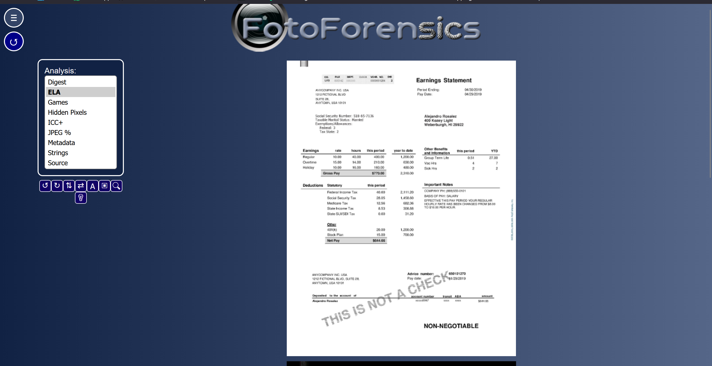

**ELA Result — Tampered Image**
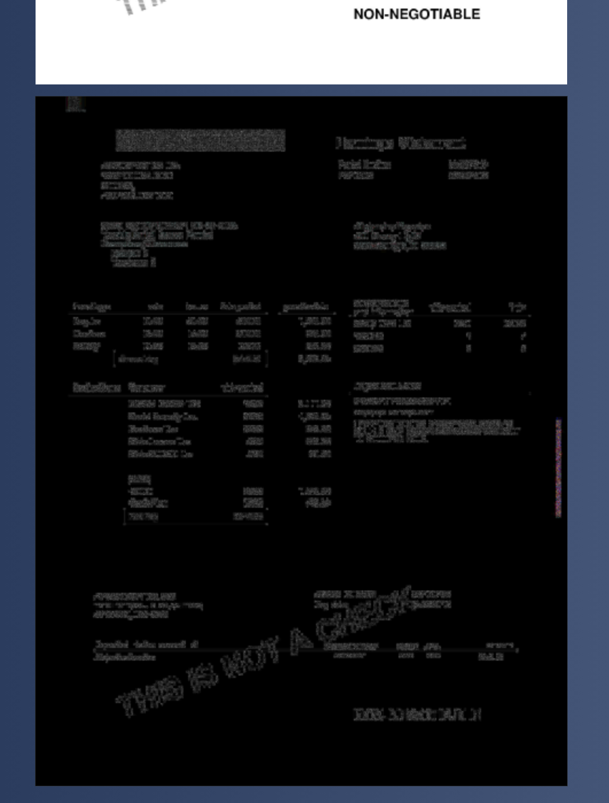

**Metadata Display — Camera Info**
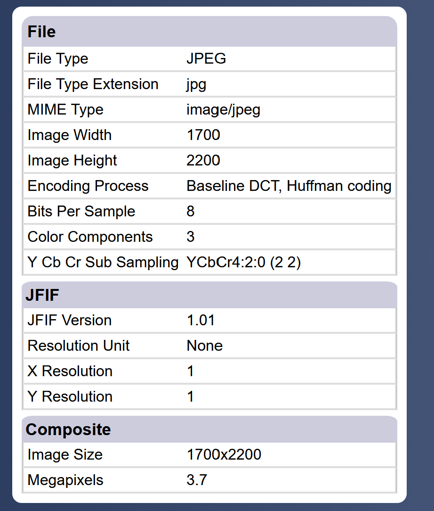

**ELA Result — Original Image**
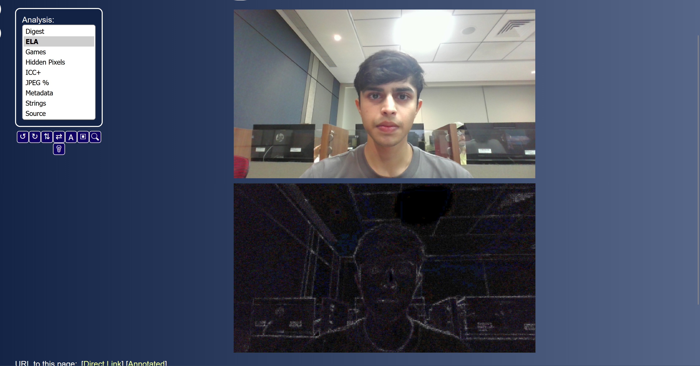

**Metadata Display — Original Image**
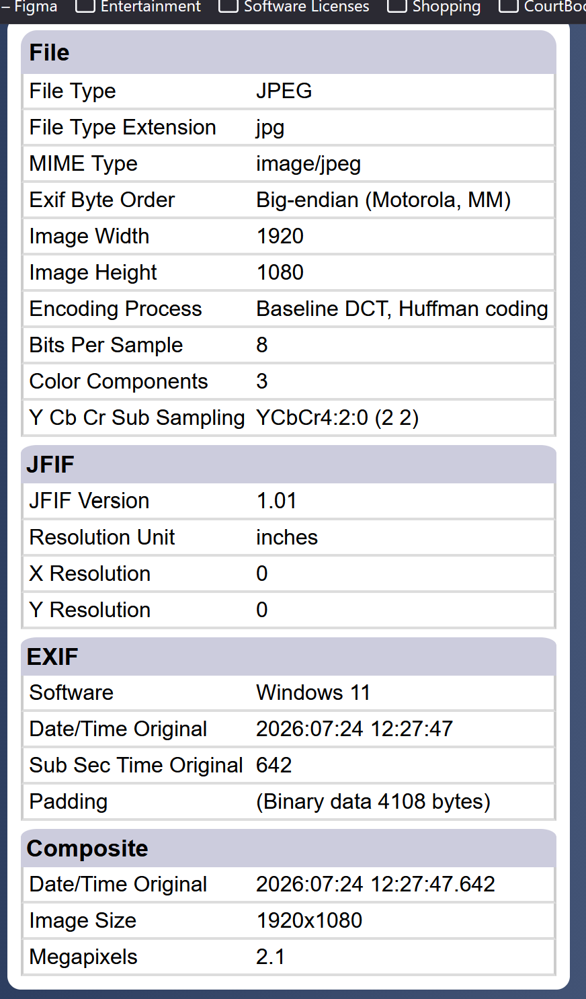

### Observations (FotoForensics)

| Image | ELA Result | Metadata Findings |
| --- | --- | --- |
| Original (Sample_photo.jpg) | Uniform compression levels | iPhone SE, iOS 11.3.1, GPS present, datetime 2018:06:01 18:33:19 |
| Tampered (Sample_photo - Copy.jpg) | Inconsistent compression, bright outlines around edited regions | iPhone SE, GPS present, dimensions swapped (3024x4032), no software tag |

## Part B — Using Ghiro (Offline Tool)

### Procedure

- Open Ghiro Web Interface: https://getghiro.org/
- Log in with credentials (admin or user)
- Create a New Case (e.g., "Tamper Test 01")
- Upload image files (original and tampered versions)
- Let Ghiro automatically analyze them
- View results for each image:
  - EXIF Metadata
  - Signature analysis
  - Tampering clues (edited using software, thumbnail mismatch, etc.)
  - Hash values (MD5, SHA1, SHA256)
- Export or screenshot the forensic report for submission

### Ghiro Interface Screenshots

**Ghiro Login Page**
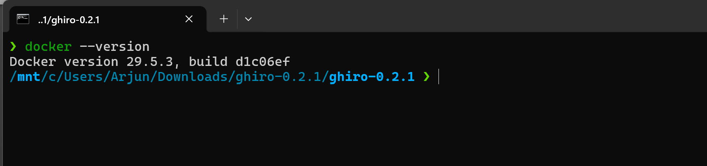

**New Case Creation**
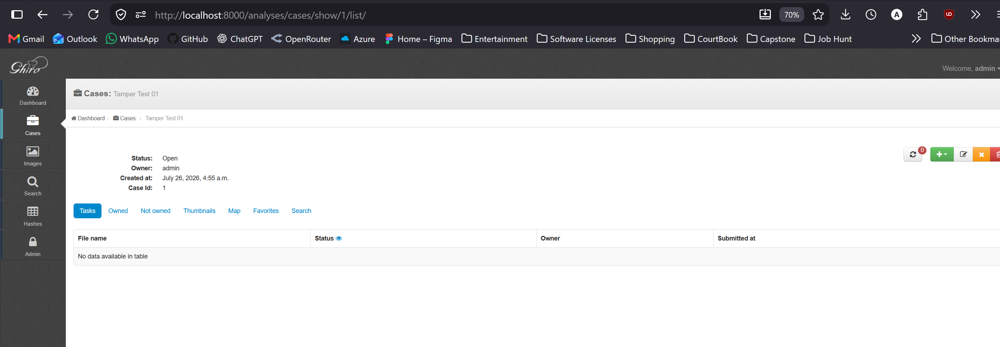

**Image Upload Interface**
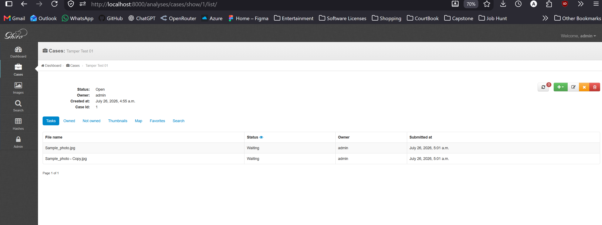

**Analysis Results — Overview**
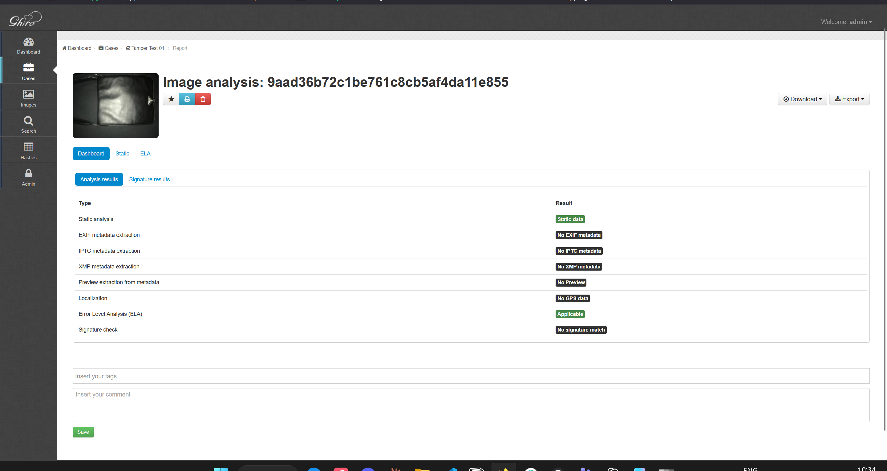
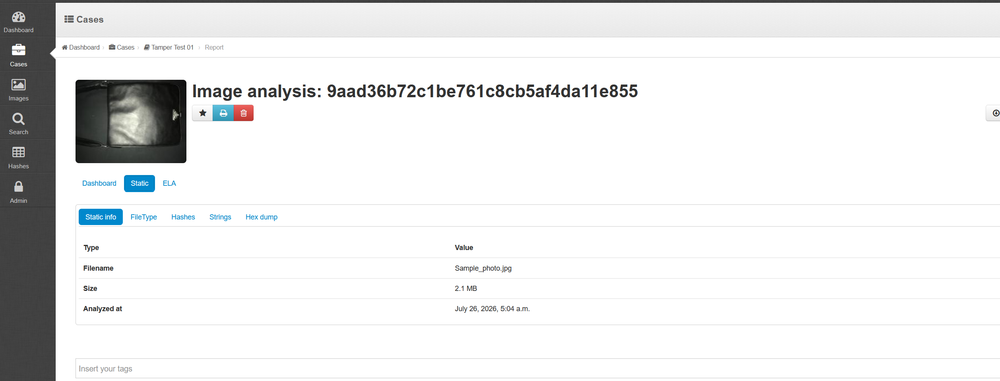
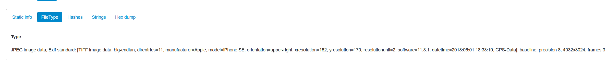
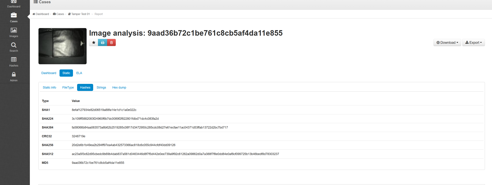

**Original Image — Detailed Analysis**
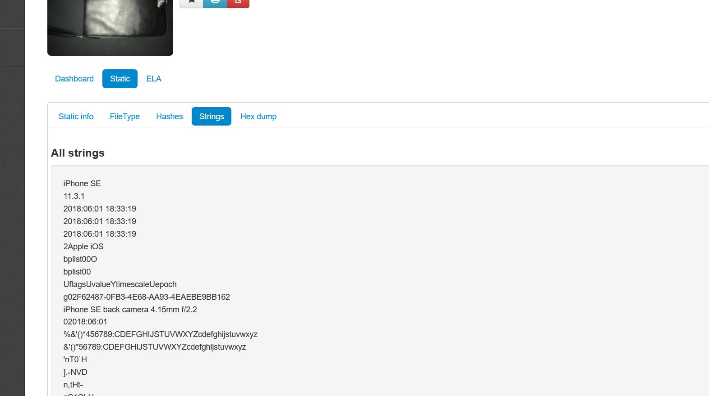
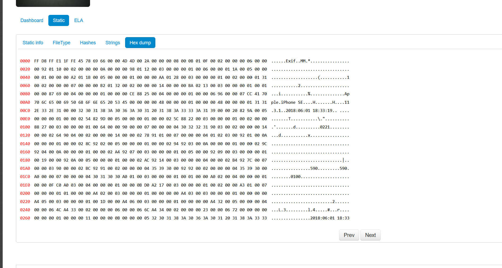

**Tampered Image — Detailed Analysis**
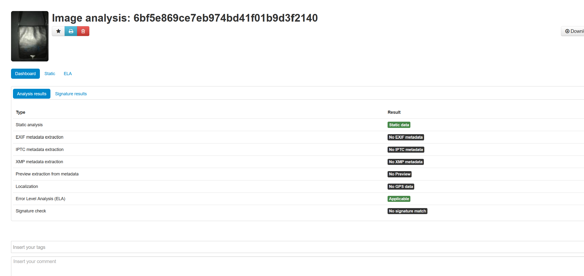
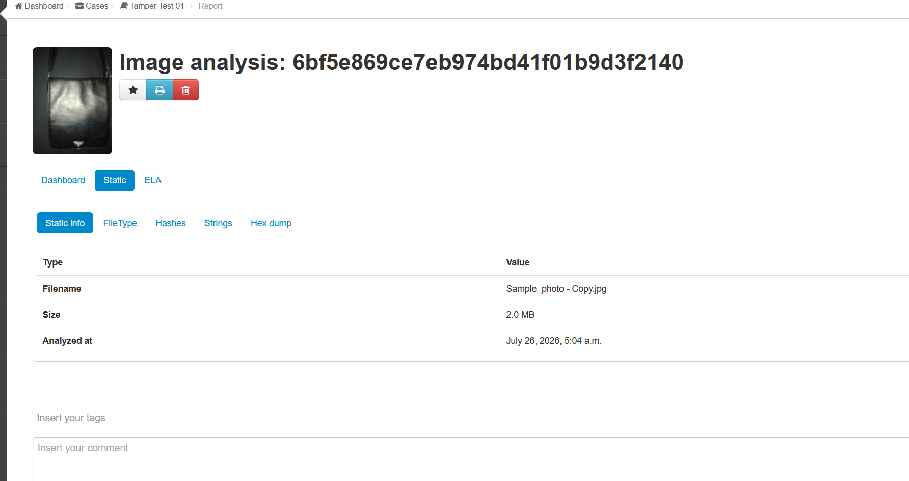
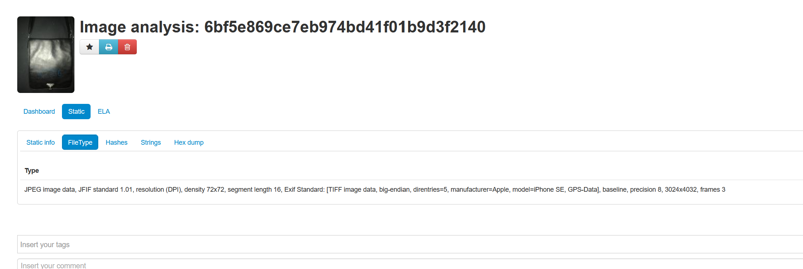
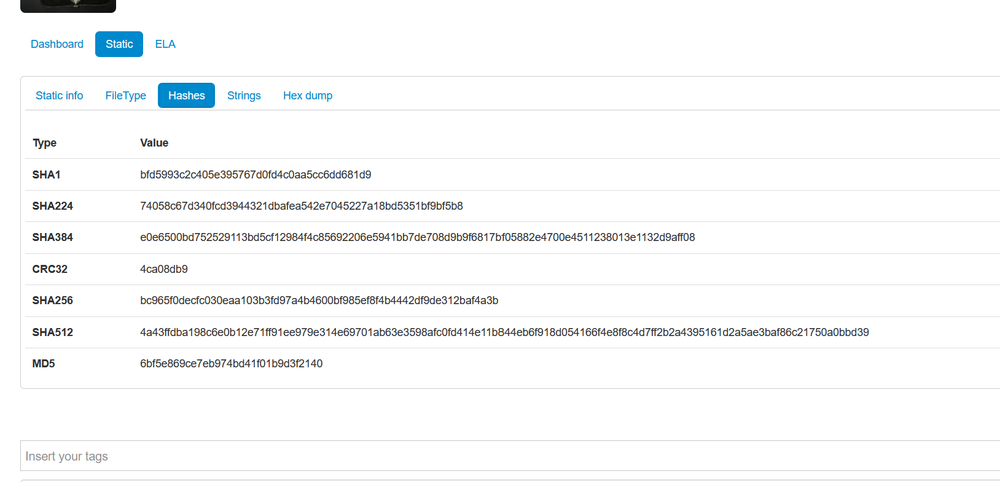
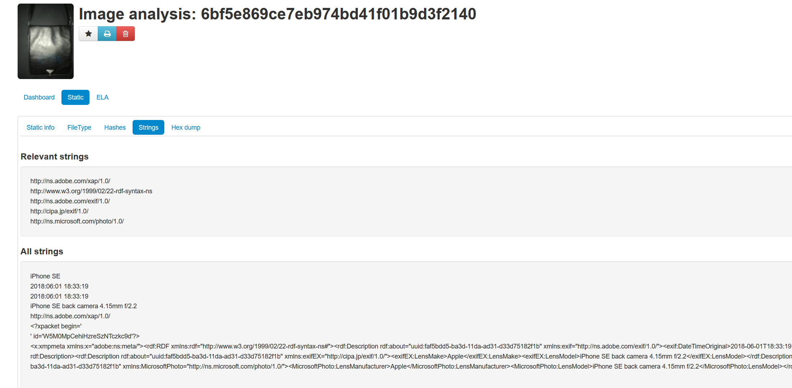
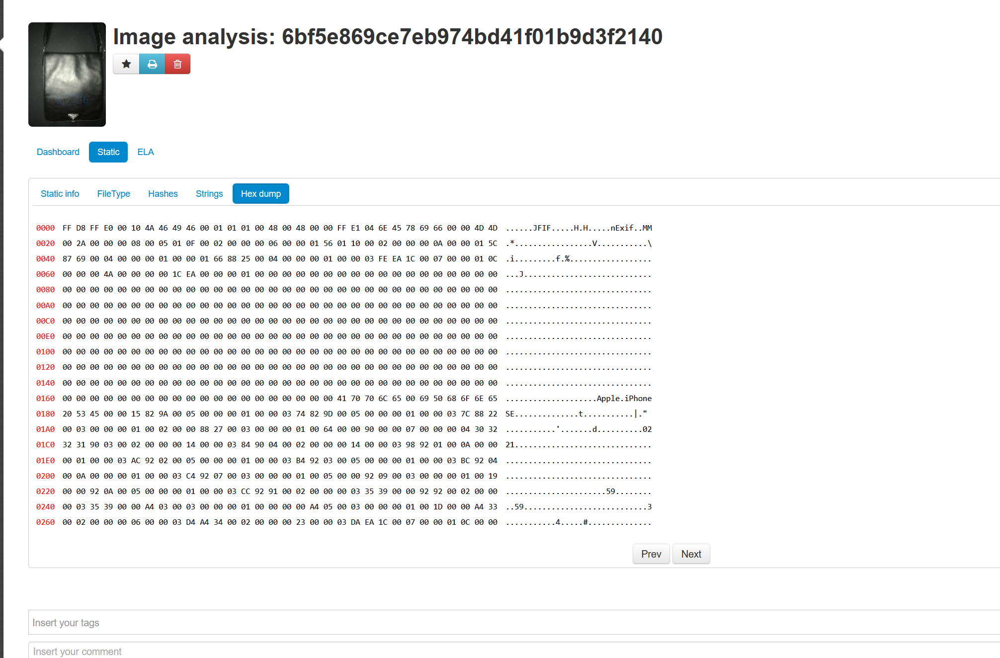

### Ghiro Analysis Results — Original Image

| Property | Value |
| --- | --- |
| **Filename** | Sample_photo.jpg |
| **Size** | 2.1 MB |
| **File Type** | JPEG, Exif standard, Apple iPhone SE, 4032x3024 |
| **EXIF** | Make: Apple, Model: iPhone SE, Software: 11.3.1, DateTime: 2018:06:01 18:33:19, GPS: Yes |
| **MD5** | 9aad36b72c1be761c8cb5af4da11e855 |
| **SHA1** | 8efaf127934e82d06519a88fa14e1d1c1a0e022c |
| **SHA256** | 20d2e6b1b49ea2b294ff97ea4ab432573366ac818c6c055c944cfdf40dd09126 |
| **ELA** | Applicable |

### Ghiro Analysis Results — Tampered Image

| Property | Value |
| --- | --- |
| **Filename** | Sample_photo - Copy.jpg |
| **Size** | 2.0 MB |
| **File Type** | JPEG, JFIF 1.01, Apple iPhone SE, 3024x4032 (rotated) |
| **EXIF** | Make: Apple, Model: iPhone SE, GPS: Yes, No software tag |
| **MD5** | 6bf5e869ce7eb974bd41f01b9d3f2140 |
| **SHA1** | bfd5993c2c405e395767d0fd4c0aa5cc6dd681d9 |
| **SHA256** | bc965f0decfc030eaa103b3fd97a4b4600bf985ef8f4b4442df9de312baf4a3b |
| **ELA** | Applicable |
| **Strings** | Adobe XAP, EXIF, Microsoft Photo namespaces present |

### Key Findings

- **Hash mismatch** — Original and tampered images have completely different MD5/SHA hashes
- **Dimension swap** — Tampered image shows 3024x4032 vs original 4032x3024 (rotation/transpose)
- **Missing software tag** — Tampered image lacks the "Software: 11.3.1" EXIF field
- **Different EXIF structure** — Tampered uses JFIF standard vs original Exif standard
- **ELA applicable** on both — Both show compression artifacts but tampered has additional anomalies

## Expected Outcome

- Students will be able to visually interpret ELA results
- Learn how to correlate metadata and file structure changes with potential manipulation
- Understand how tools like Ghiro automate and validate image forensic investigations

## Submission Requirements

- At least one screenshot from FotoForensics showing ELA result
- At least one screenshot/report from Ghiro analysis
- Complete Observation Table for minimum 3 images
- Mention any interesting findings (e.g., edited image software, GPS tampering)

## Attached Reports

- [[Lab 2/GHIRO-original-html-report.htm|GHIRO Original HTML Report]]
- [[Lab 2/GHIRO-tampered-html-report.htm|GHIRO Tampered HTML Report]]