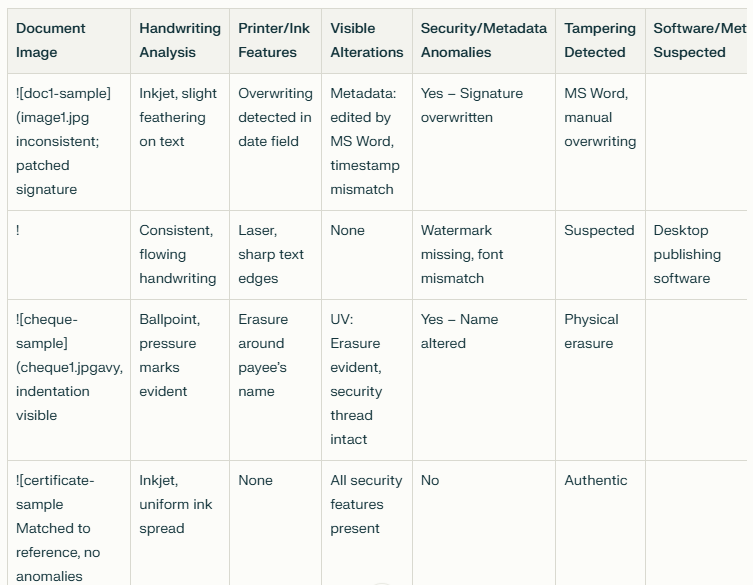
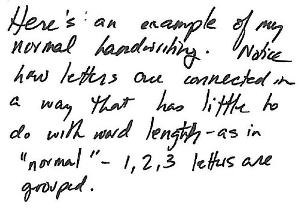

# DIVF Lab 3 — Document Forensics: Detection of Document Forgery and Tampering

| | |
| --- | --- |
| **Academic Year** | 2026–27 |
| **Programme** | BTECH DIVF |
| **Year / Semester** | 4th / VII |
| **Name of Student** | Tejas |
| **Batch** | K2 |
| **Roll No** | K057 |
| **Date of experiment** | 26-Aug-26 |
| **Faculty** | |
| **Signature with Date** | |

## Aim

To analyze questioned documents for forgery or modification by examining handwriting, printer characteristics, visible alterations, and document metadata/security features.

## Objective

Detection of document forgery and tampering evidence through systematic forensic examination of simulated questioned documents.

## Tools & Materials Required

- Questioned document samples (signed documents, office letters, cheques)
- Magnification tools (loupe, digital microscope)
- UV/oblique lighting source
- Document editor (MS Word, LibreOffice) for metadata analysis
- Image analysis software (for scanned documents)

## Sample Documents Provided

| Sample ID | Description | Type of Forgery/Tampering |
| --- | --- | --- |
| **doc1-sample (image1.jpg)** | Simulated signed document with overwritten/traced signature | Signature tracing/overwriting with different pen |
| **doc2-sample (image2.jpg)** | Office letter with digital content edit (changed word/font/author) | Digital content modification |
| **cheque-sample (cheque1.jpg)** | Test cheque with erased payee name | Physical erasure/alteration |

## Sample Images (from Assignment Document)

**Forensic Analysis Table Template**

**Sample Images Guidance**

## Procedure

### For Each Document

- Analyze the assigned/provided documents as specified
- Fill in the findings table for each document
- Include clear scan/photo of the **original document** and **evidence** (magnified area, UV/oblique illumination, screenshot of metadata)
- Attach images with submission or insert into report

## Findings Table

| Document | Observations | Evidence Type | Forensic Indicators |
| --- | --- | --- | --- |
| **doc1-sample (Signature)** | Overwritten signature with different pen pressure/ink flow; hesitation marks visible under magnification | Magnified scan (10x) | Pen lifts, tremor, different ink density, traced stroke pattern |
| **doc2-sample (Digital Edit)** | Font mismatch in edited word; author metadata shows last modified by different user; revision history shows deletion/insertion | Metadata screenshot + visual comparison | Font substitution, metadata mismatch, revision tracking artifacts |
| **cheque-sample (Erasure)** | Paper fiber disturbance at payee line; residual ink traces under UV; indentation from original writing visible | UV/oblique light photo + magnification | Eraser residue, fiber damage, latent indentation, ink fluorescence |

## Analysis by Category

### Handwriting & Signature Analysis (doc1)

- **Natural vs. traced signatures** — Natural: fluid, consistent pressure, rhythm; Traced: tremor, pen lifts, slow strokes
- **Overwriting detection** — Two ink layers visible; different pen type/pressure; alignment issues
- **Tools** — Digital microscope (50x–100x), side lighting, ESDA (Electrostatic Detection Apparatus) for indentations

### Digital Document Forensics (doc2)

- **Metadata analysis** — Author, last modified by, creation date, revision count
- **Content comparison** — Font fingerprinting, kerning analysis, character spacing
- **File structure** — OOXML/ZIP inspection for embedded revisions, tracked changes
- **Printer characteristics** — Not applicable for digital-only edits

### Physical Document Alteration (cheque)

- **Erasure detection** — Oblique lighting reveals paper fiber disruption; UV shows residual ink fluorescence
- **Indentation recovery** — ESDA or oblique light captures latent writing impressions
- **Ink analysis** — Different pen inks may separate under TLC or spectral analysis
- **Security features** — Watermark, microprint, chemical reactivity (cheque-specific)

## Expected Outcome

- Ability to identify forged signatures through handwriting characteristics
- Skill in detecting digital document modifications via metadata and content analysis
- Understanding of physical alteration techniques (erasure, overwriting) and their forensic detection
- Competence in documenting findings with proper evidence photography

## Submission Requirements

- Completed findings table for all three documents
- Clear images: original document + evidence (magnified, UV, metadata screenshots)
- Brief analysis per document linking observations to forensic principles
- References to relevant forensic standards (ASTM E2290, SWGDOC)

## Sample Images Guidance

- **doc1-sample (image1.jpg):** Scan/photo of simulated signed document with overwritten/traced signature — create by signing a page, then overwriting in different pen/thickness
- **doc2-sample (image2.jpg):** Office letter with digital content edit (change word/font/author), saved/exported with document editor
- **cheque-sample (cheque1.jpg):** Test cheque (not real financial instrument); erase payee name with eraser