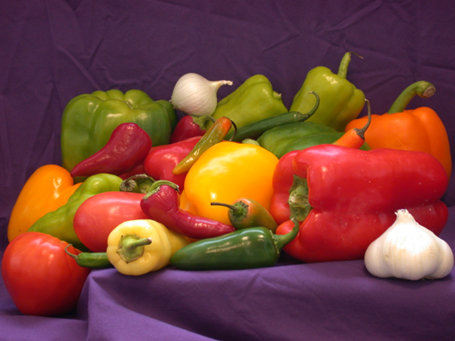
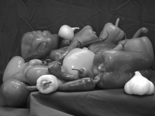
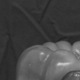
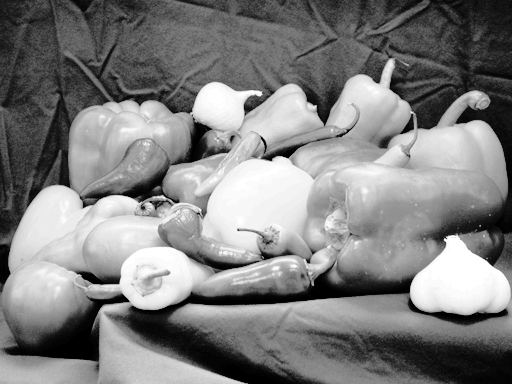
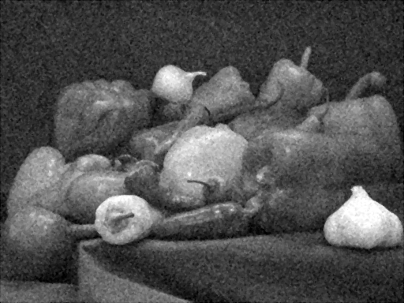
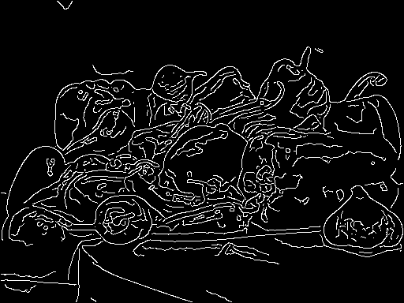
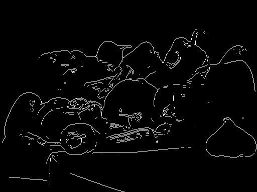

# DIVF Lab 4 — Image Processing Fundamentals using MATLAB

| | |
| --- | --- |
| **Academic Year** | 2026–27 |
| **Programme** | BTECH DIVF |
| **Year / Semester** | 4th / VII |
| **Name of Student** | Tejas |
| **Batch** | K2 |
| **Roll No** | K057 |
| **Date of experiment** | 01-Sep-26 |
| **Faculty** | |
| **Signature with Date** | |

## Aim

To implement and understand basic image processing operations including image reading, transformation, enhancement, noise filtering, and edge detection using MATLAB.

## Tools Required

- MATLAB R2020a or later
- Image Processing Toolbox
- Sample images (peppers.png or any test image)

## Part A — Basic Image Operations

### Task 1: Image Reading and Display

**MATLAB Code**

```matlab
I = imread('peppers.png');           % Read built-in sample color image (RGB)
figure; imshow(I);                   % Show color image in a NEW window
title('Original Color Image');
I_gray = rgb2gray(I);                % Convert RGB to grayscale (luminance 0-255)
figure; imshow(I_gray);
title('Grayscale Image');
imwrite(I, 'task1_color.png');       % Save outputs for the report
imwrite(I_gray, 'task1_gray.png');
```

**Output Screenshots**

**Original Color Image (peppers.png)**


**Grayscale Conversion**


**Observations**

- **Color vs Grayscale** — The color image has three channels (R, G, B) per pixel while the grayscale image keeps only one intensity value per pixel. Color information is lost but shapes and brightness remain the same.
- **Pixel intensity in grayscale** — Each pixel is converted to a single value between 0 (black) and 255 (white) based on the weighted brightness of its original red, green and blue values (0.2989 × R + 0.5870 × G + 0.1140 × B).

### Task 2: Image Resizing and Cropping

**MATLAB Code**

```matlab
I_resized = imresize(I_gray, 0.5);          % Scale to 50% (half width & half height)
figure; imshow(I_resized);
title('Resized Image (50%)');

% Crop rectangle = [x y width height]: start at pixel (50,50), take 100x100 px
I_cropped = imcrop(I_gray, [50 50 100 100]);
figure; imshow(I_cropped);
title('Cropped Region');

imwrite(I_resized, 'task2_resized.png');
imwrite(I_cropped, 'task2_cropped.png');
```

**Output Screenshots**

**Resized Image (50%)**


**Cropped Region (100×100 from 50,50)**


**Observations**

- **Resizing and resolution** — Reducing the image to half its size cuts the total pixels to one-fourth, so fine details become less sharp (loss of high-frequency information).
- **Cropping** — Cropping cuts out only the selected 100×100 region from the original image while keeping its original sharpness (no interpolation).

### Task 3: Histogram Analysis

**MATLAB Code**

```matlab
figure; imhist(I_gray);                      % Histogram = pixel count per intensity level (0-255)
title('Histogram of Grayscale Image');

I_eq = histeq(I_gray);                       % Equalize histogram -> spreads intensities, boosts contrast
figure; imshow(I_eq);
title('Histogram Equalized Image');

% Side-by-side histogram comparison
figure;
subplot(1,2,1); imhist(I_gray); title('Original Histogram');
subplot(1,2,2); imhist(I_eq); title('Equalized Histogram');

imwrite(I_eq, 'task3_equalized.png');
```

**Output Screenshots**

**Histogram Equalized Image**


**Observations**

- **Histogram equalization and contrast** — After equalization the image looks brighter and details are clearer because pixel intensities are spread over the full 0–255 range instead of being crowded in a narrow band.
- **Change in intensity distribution** — The equalized histogram is much more spread out and flatter compared to the original histogram which is concentrated around middle intensities.

## Part B — Image Enhancement and Filtering

### Task 4: Noise Addition and Removal

**MATLAB Code**

```matlab
I_noisy = imnoise(I_gray, 'gaussian');       % Add Gaussian noise (default mean 0, var 0.01)
figure; imshow(I_noisy);
title('Image with Gaussian Noise');

% Mean (averaging) filter with a 3x3 kernel
% Replaces each pixel by the average of its 3x3 neighborhood
% Smooths noise but also blurs edges
h = fspecial('average', [3 3]);
I_mean = imfilter(I_noisy, h);
figure; imshow(I_mean);
title('Mean Filtered Image');

% Median filter (3x3 default)
% Replaces each pixel by the MEDIAN of its neighborhood
% Removes noise while preserving edges better
I_median = medfilt2(I_noisy);
figure; imshow(I_median);
title('Median Filtered Image');

imwrite(I_noisy, 'task4_noisy.png');
imwrite(I_mean, 'task4_mean.png');
imwrite(I_median, 'task4_median.png');
```

**Output Screenshots**

**Image with Gaussian Noise**


**Mean Filtered (3×3 average)**


**Median Filtered (3×3 median)**


**Observations**

- **Mean vs Median filtering** — The mean filter makes the noisy image smooth but blurs edges (linear filter). The median filter removes the noise and still keeps the edges fairly sharp (non-linear, order-statistic filter).
- **Better filter** — The median filter removes Gaussian noise better while preserving edges, so its output looks cleaner than the mean filtered image.

### Task 5: Edge Detection

**MATLAB Code**

```matlab
I_sobel = edge(I_gray, 'sobel');             % Sobel: simple gradient operator (3x3 masks)
figure; imshow(I_sobel);
title('Sobel Edge Detection');

I_canny = edge(I_gray, 'canny');             % Canny: multi-stage (smoothing + gradient +
figure; imshow(I_canny);                     % non-max suppression + hysteresis thresholding)
title('Canny Edge Detection');

imwrite(I_sobel, 'task5_sobel.png');
imwrite(I_canny, 'task5_canny.png');

disp('All tasks complete. Output images saved in the Current Folder.');
```

**Output Screenshots**

**Sobel Edge Detection**


**Canny Edge Detection**


**Observations**

- **Edge clarity and noise sensitivity** — Sobel gives thicker edges and also picks up some noise (single-stage gradient). Canny gives thin, clean, and well-connected edges (multi-stage with smoothing).
- **More accurate method** — Canny gives more accurate edge detection because it smooths the image first and uses double thresholding (hysteresis) to keep only the true edges.

## Complete MATLAB Script (All Tasks)

```matlab
clc; clear; close all;

%% ============ PART A: BASIC IMAGE OPERATIONS ============

%% Task 1: Image Reading and Display
I = imread('peppers.png');
figure; imshow(I); title('Original Color Image');
I_gray = rgb2gray(I);
figure; imshow(I_gray); title('Grayscale Image');
imwrite(I, 'task1_color.png');
imwrite(I_gray, 'task1_gray.png');

%% Task 2: Image Resizing and Cropping
I_resized = imresize(I_gray, 0.5);
figure; imshow(I_resized); title('Resized Image (50%)');
I_cropped = imcrop(I_gray, [50 50 100 100]);
figure; imshow(I_cropped); title('Cropped Region');
imwrite(I_resized, 'task2_resized.png');
imwrite(I_cropped, 'task2_cropped.png');

%% Task 3: Histogram Analysis
figure; imhist(I_gray); title('Histogram of Grayscale Image');
I_eq = histeq(I_gray);
figure; imshow(I_eq); title('Histogram Equalized Image');
figure;
subplot(1,2,1); imhist(I_gray); title('Original Histogram');
subplot(1,2,2); imhist(I_eq); title('Equalized Histogram');
imwrite(I_eq, 'task3_equalized.png');

%% ============ PART B: ENHANCEMENT AND FILTERING ============

%% Task 4: Noise Addition and Removal
I_noisy = imnoise(I_gray, 'gaussian');
figure; imshow(I_noisy); title('Image with Gaussian Noise');

h = fspecial('average', [3 3]);
I_mean = imfilter(I_noisy, h);
figure; imshow(I_mean); title('Mean Filtered Image');

I_median = medfilt2(I_noisy);
figure; imshow(I_median); title('Median Filtered Image');

imwrite(I_noisy, 'task4_noisy.png');
imwrite(I_mean, 'task4_mean.png');
imwrite(I_median, 'task4_median.png');

%% Task 5: Edge Detection
I_sobel = edge(I_gray, 'sobel');
figure; imshow(I_sobel); title('Sobel Edge Detection');

I_canny = edge(I_gray, 'canny');
figure; imshow(I_canny); title('Canny Edge Detection');

imwrite(I_sobel, 'task5_sobel.png');
imwrite(I_canny, 'task5_canny.png');

disp('All tasks complete. Output images saved in the Current Folder.');
```

## Expected Outcome

- Understanding of basic image I/O, color space conversion, and display
- Proficiency in geometric transformations (resize, crop)
- Knowledge of histogram-based contrast enhancement
- Ability to add/remove noise and compare filtering techniques
- Competence in edge detection algorithms and their trade-offs

## Submission Guidelines

- Submit a report with:
  - MATLAB code for each task (well-commented and organized)
  - Screenshots of outputs (figures/images)
  - Observations and explanations for each result
- Ensure code is well-commented and organized
- Save all output images as specified in the code

## Key Takeaways

| Operation | Key Insight |
| --- | --- |
| `rgb2gray` | Luminance-weighted conversion (ITU-R BT.601) |
| `imresize` | Interpolation reduces resolution; information loss is irreversible |
| `imcrop` | Non-destructive region extraction; preserves original pixel values |
| `histeq` | Spreads histogram; best for low-contrast images |
| `imnoise` + `medfilt2` | Median filter preferred for salt-and-pepper/Gaussian noise with edge preservation |
| `edge('canny')` | Multi-stage optimal detector; uses hysteresis thresholding |
| `edge('sobel')` | Simple gradient; faster but noisier and thicker edges |