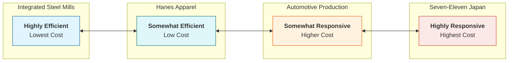

---

Title: "Process View of Supply Chain"

Status:

marker:

tags:

Date: "2026.01.16"

Time: "16:20"

---
## Process Views of a Supply Chain

There are two main ways to categorize and view the processes performed in a supply chain:

1. **Cycle View:** Processes are divided into series of cycles, each performed at the interface between two successive stages.
2. **Push/Pull View:** Processes are divided based on their timing relative to the customer order.

---

## The Cycle View

This view defines the processes involved and the distinct roles at each stage. Not every supply chain will have all four cycles (e.g., a direct-to-consumer manufacturer skips the replenishment cycle).

### Customer Order Cycle

* **Scope:** The interface between the **Customer** and the **Retailer**.
* **Trigger:** Customer initiates demand.
* **Key Activities:** Order arrival, order entry, order fulfillment, and order receiving.
* **Example:** A customer buying a book from Amazon.

### Replenishment Order Cycle

* **Scope:** The interface between the **Retailer** and the **Distributor/Wholesaler**.
* **Trigger:** Retailer inventory drops below a certain point.
* **Goal:** Restore inventory levels at the retailer to meet future demand.
* **Key Concept:** Balances the cost of holding inventory vs. the cost of placing orders.

### Manufacturing Order Cycle

* **Scope:** The interface between the **Distributor** and the **Manufacturer**.
* **Trigger:** Distributor orders or production scheduling.
* **Goal:** Produce products to replenish distributor inventory.
* **Special Case: Drop Shipping**
* In a drop-shipping model, the retailer does not hold inventory.
* The **Replenishment Cycle is bypassed**.
* The Customer Order travels directly to the Manufacturer or Wholesaler, merging the customer loop closer to the manufacturing loop.

### Procurement Order Cycle

* **Scope:** The interface between the **Manufacturer** and the **Supplier**.
* **Trigger:** Manufacturing schedules require raw materials.
* **Goal:** Ensure materials are available for production without overstocking.
* **Example:** An automobile company ordering outsourced tires or steel sheets to arrive just in time for assembly.

---

## Push vs. Pull View

This view categorizes processes based on when they are executed relative to end-customer demand.

### Pull Processes (Reactive)

* **Timing:** Execution initiates **in response** to a customer order.
* **Constraint:** Operates on actual demand.
* **Focus:** Responsiveness.

### Push Processes (Speculative)

* **Timing:** Execution initiates **in anticipation** of customer orders (based on forecasts).
* **Constraint:** Operates on predicted demand.
* **Focus:** Efficiency and cost optimization.

---

## Strategic Fit

Strategic fit refers to the consistency between the customer priorities (competitive strategy) and the supply chain capabilities (supply chain strategy).

### Step 1: Understanding Uncertainty

* You must assess **Implied Demand Uncertainty**: The uncertainty varies based on the segment you target.
* *High Uncertainty:* Innovative products, short life cycles, high variety.
* *Low Uncertainty:* Functional products, staples, long life cycles.

### Step 2: Understanding Supply Chain Capabilities

* Supply chains fall on a spectrum between two extremes:
* **High Responsiveness:** Ability to handle high variety, fast delivery, and demand swings (e.g., Dell).
* **High Efficiency:** Ability to minimize cost per unit (e.g., Costco, Wal-Mart).

### Step 3: Achieving Strategic Fit

* The goal is to align the supply chain structure with the demand uncertainty.
* **The Mismatch Trap:** A company targeting high-uncertainty customers with a highly efficient (slow, low-cost) supply chain will fail.
* **The "Zone of Strategic Fit":**
* **High Uncertainty Demand**  Needs **Responsive Supply Chain**.
* **Low Uncertainty Demand**  Needs **Efficient Supply Chain**.

## Cost-Responsiveness Efficient Frontier

### The Concept: The Trade-Off

* **The Curve:** Represents the lowest possible cost for a given level of responsiveness.
* **The Trade-off:** High responsiveness usually incurs higher costs (inventory, speed, capacity).
* **Goal:** Operate *on* the frontier (efficient), not *below* it (inefficient).

### The Spectrum of Responsiveness

### Spectrum Breakdown

**1. Highly Efficient: Integrated Steel Mills**

* **Focus:** Cost minimization.
* **Scheduling:** Production set weeks/months in advance.
* **Flexibility:** Minimal variety; rigid operations.
* **Lead Time:** Long.

**2. Somewhat Efficient: Hanes Apparel**

* **Focus:** Low cost, standard availability.
* **Model:** Traditional "Make-to-Stock".
* **Lead Time:** Several weeks.
* **Flexibility:** Limited to standard SKUs.

**3. Somewhat Responsive: Automotive Production**

* **Focus:** Variety handling.
* **Variety:** Large range of configurations.
* **Lead Time:** Couple of weeks (faster than apparel).
* **Flexibility:** Moderate; customized assembly.

**4. Highly Responsive: Seven-Eleven Japan**

* **Focus:** Immediate convenience.
* **Responsiveness:** Adapts to location & time of day.
* **Merchandise:** Changes frequently (breakfast vs. dinner items).
* **Cost structure:** Higher (due to frequent replenishment/prime real estate).

## Fast Fashion Apparrel brands
- Understand ur customer uncertainty High Uncertainty
	- Fashion Trends change
	- Baggy or skinny
	- Luxury vs R
	- Weather & season
	- Collaboration 
	- Festivals
	- Regionwise selling
- Capability
	- High responsiveness ( Zara )
		- Able to bend to trends
		- Able to design on adhoc basis
		- Able to execute designs in products with very less time with good reliability
- Strategic Fit
	- Manufactured in Bhutan and Bangladesh
	- Avoiding countries in warzones for manufacturing ( NETANYAHU )
	- Testing products lowkey before selling them highkey to avoid clearance
		- Smaller batches and stuffs
	- Backup Plans
	- Releasing a product
	- Delaying demand to get

