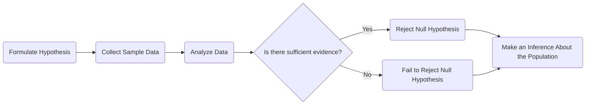

# Hypothesis Testing and Prerequisite Knowledge

A **hypothesis** is a **statement or assumption** about a **population parameter** (e.g., mean, proportion) that can be tested using statistical methods. It is the foundation of **hypothesis testing**, which determines whether there is enough statistical evidence in a sample to **infer** a conclusion about the entire population.

## Karl Popper's Philosophy

Whenever there is a **conjecture**, which is a statement that is not yet proved, according to Karl Popper, it is easier to disprove it by showing **empirical evidence**. The conjecture is called the **null hypothesis** ($H_0$), and the opposite of it is called the **alternative hypothesis** ($H_1$).

## Attributes

- **Population**: In hypothesis testing, the number of subjects that are measured is called the population.
- **Sampling**: The reduced amount of data.
  - It is used largely by government, industries, etc., when the data is too hard to collect, and we collect a sample of the data.
- $H_0$: Null Hypothesis
- $H_1$: Alternative Hypothesis

## Surveys

- Surveys are used to collect data from a population.
- The data is collected from a sample of the population.
- The data is then analyzed to make a statement about the population.

## Parameters & Statistics

We use Greek letters for population parameters and English letters for sample statistics.

- **Population Measures**:
  - Mean ($\mu$)
  - Variance ($\sigma^2$)
- **Sample Measures**:
  - Mean ($\bar{x}$)
  - Variance ($s^2$)

## Statistical Hypothesis

### Hypothesis
- A new drug significantly reduces blood pressure.

### Null Hypothesis
- **Definition**: A definite statement about a population parameter which is tested for possible rejection under the assumption that it is true. It is usually a hypothesis of no difference. Represented by $H_0$.
- **Example**: The new drug does not reduce blood pressure compared to a placebo.

### Testing Process
- Researchers would conduct a clinical trial, and if the data shows a statistically significant decrease in blood pressure in the drug group, then the hypothesis could be accepted. Otherwise, it is rejected.

### Alternative Hypothesis
- Any hypothesis that is complementary to the null hypothesis is called an alternative hypothesis and is denoted by $H_1$.

## Types of Errors
- **Type 1 Error**: Rejecting a true null hypothesis. The probability of making a Type 1 error is denoted by $\alpha$.
  - $P(\text{Rejecting } H_0 | H_0) = \alpha$
  - **Examples**:
    - Convicting an innocent person.
    - 100 phones produced, 10 phones sampled, 1 defective phone found (Type 1 error).

- **Type 2 Error**: Accepting a false null hypothesis. The probability of making a Type 2 error is denoted by $\beta$.
  - $P(\text{Accepting } H_0 | H_1) = \beta$
  - **Examples**:
    - Acquitting a guilty person.
    - 100 phones produced, 10 phones sampled, no defective phones found (Type 2 error).

- $\alpha$ and $\beta$ are referred to as Producer's Risk and Consumer's Risk, respectively.

## Example Problems

### Example 1

Average marks of boys are not the same as average marks of girls.

- Let average marks for boys be $\mu_1$ and average marks of girls be $\mu_2$.
- $H_0: \mu_1 = \mu_2$
- $H_1: \mu_1 \neq \mu_2$

### Example 2
Average height of boys is more than average height of girls.

- Let average height for boys be $\mu_1$ and average height of girls be $\mu_2$.
- $H_0: \mu_1 = \mu_2$
- $H_1: \mu_1 > \mu_2$

## One-Tailed & Two-Tailed Tests
Given a sample size $n_1$ with average $\bar{x}_1$, and another sample size $n_2$ with average $\bar{x}_2$, we can perform the following tests:

- **Right-Tailed Test**:
  - $H_0: \mu = \mu_0$
  - $H_1: \mu > \mu_0$

- **Left-Tailed Test**:
  - $H_0: \mu = \mu_0$
  - $H_1: \mu < \mu_0$

- **Two-Tailed Test**:
  - $H_0: \mu = \mu_0$
  - $H_1: \mu \neq \mu_0$

## Level of Significance

The probability, let's say $\alpha$, of rejecting a true null hypothesis is called the level of significance.

- $P(\text{Rejecting } H_0 | H_0) = \alpha$

The level of significance is the probability of rejecting a true null hypothesis. It is denoted by $\alpha$.

If we know the probability $\alpha$, we can calculate the $Z$ value. The $Z$ value is the number of standard deviations a data point is from the mean.

### Example

If $\alpha = 0.05$, we look closely at the Z table and find that the value of $Z_{\alpha}$ is 1.96.

### Confidence Interval

The confidence interval is the range of values within which the true value of the parameter is expected to lie with a certain level of confidence. The confidence interval is denoted by $1 - \alpha$ where $\alpha$ is the level of significance.

$$
(\bar{X} - Z_{\alpha} \frac{\sigma}{\sqrt{n}}, \bar{X} + Z_{\alpha} \frac{\sigma}{\sqrt{n}})
$$

# Tests of Significance Problems

## Question 1

Test of significance between population mean and sample mean. A sample size is considered larger if the sample size is greater than 30. If the sample size is less than 30, then the sample size is considered small.

### Problem Statement

- Sample size = 100
- Standard Deviation $\sigma$ = 10 cm
- Sample Mean $\bar{X}$ = 160 cm
- Mean Height $\mu$ = 165 cm

- $H_0: \mu = 165$
- $H_1: \mu \neq 165$ (Two-Tailed Test)

- $\alpha = 0.05$
- $Z_{\alpha} = 1.96$

### Solution

Solving test statistics:

$$
Z = \frac{\bar{X} - \mu}{\frac{\sigma}{\sqrt{n}}} = \frac{160 - 165}{\frac{10}{\sqrt{100}}} = -5
$$

Since $|Z| = 5 > Z_{\alpha} = 1.96$, we reject $H_0$.

**Conclusion**: Reject $H_0$

## Question 2

A random sample of 200 measurements from a large population has a mean of 50 and a standard deviation of 10. Test the hypothesis that the population mean is 52 against the alternative hypothesis that the population mean is not 52. Use a level of significance of 0.05.

### Problem Statement

- Sample size = 200
- Sample Mean $\bar{X}$ = 50
- Standard Deviation $\sigma$ = 10
- Population Mean $\mu$ = 52

- $H_0: \mu = 52$
- $H_1: \mu \neq 52$ (Two-Tailed Test)

- $\alpha = 0.05$
- $Z_{\alpha} = 1.96$

### Solution

Solving test statistics:

$$
Z = \frac{\bar{X} - \mu}{\frac{\sigma}{\sqrt{n}}} = \frac{50 - 52}{\frac{10}{\sqrt{200}}} = -2.828
$$

Since $|Z| = 2.828 > Z_{\alpha} = 1.96$, we reject $H_0$.

**Conclusion**: Reject $H_0$

# Small Sample Tests

If the sample size is less than 30, then the sample size is considered small. The test statistic is calculated using the t-distribution.

- Degrees of freedom = $n - 1$
- $T_{\alpha}$ is the t value for the level of significance $\alpha$ and degrees of freedom $n - 1$.

The sample mean $\bar{x}$ is calculated as:

$$
\bar{x} = \frac{x_1 + x_2 + x_3 + \cdots + x_n}{n}
$$

When $\bar{x}$ is known, we can ignore only one value, thus degree of freedom is $n - 1$.

The t-statistic is given by:

$$
T = \frac{\bar{X} - \mu}{\frac{s}{\sqrt{n - 1}}}
$$

### Properties of t-distribution

- The t-distribution is symmetric about the mean.
- The t-distribution has a mean of 0.
- The t-distribution is more spread out than the standard normal distribution.

### Formula for Comparing Two Small Samples

$$
T = \frac{\bar{x}_1 - \bar{x}_2}{\sqrt{\frac{n_1 s_1^2 + n_2 s_2^2}{n_1 + n_2 - 2} \left( \frac{1}{n_1} + \frac{1}{n_2} \right)}}
$$

## Problems with Small Datasets

### Question 1

A machine solves a problem in 1.75 seconds. A new machine is introduced and the time taken to solve the problem is 1.85 seconds. The standard deviation is 0.1. Test the hypothesis that the new machine is inferior to the old machine. Use a level of significance of 0.05.

### Problem Statement

- $n = 10$
- $H_0: \mu = 1.75$ (machine is not inferior)
- $H_1: \mu \neq 1.75$ (Two-Tailed Test, machine is inferior)
- $\bar{X} = 1.85$
- $\sigma = 0.1$
- $\alpha = 0.05$
- Degrees of freedom = $n - 1 = 9$
- $T_{\alpha} = 2.262$

### Solution

$$
T = \frac{1.85 - 1.75}{\frac{0.1}{\sqrt{9}}} = 3
$$

Since $T = 3 > T_{\alpha} = 2.262$, we reject $H_0$.

**Conclusion**: Reject $H_0$

### Question 2

A certain injection is administered. Will it always...

### Problem Statement

- $n = 12$
- $\bar{X} = 2.4167$
- $\sigma = 3.09$

- $H_0: \mu = 0$
- $H_1: \mu > 0$ (There is a significant difference)

# Test of Significance of Difference Between Two Large Sample Means

Testing of significance of difference between two large samples means. We will now have two values of $\bar{X}$ and two values of $\sigma$ and two values of $n$. We will also calculate the $Z$ value for the two samples.

If student 1 is asked to get a sample of college students with marks and student 2 is asked to get another sample. The standard deviation will remain the same. This is because student 1 and student 2...

When the samples are too large it will follow standard normal distribution. When the samples are too small it will follow the t-distribution. Assumption will be made on the basis of sample size.

### Cases

- **Case 1**: $\sigma_1 = \sigma_2$ and known
- **Case 2**: $\sigma_1 = \sigma_2$ and unknown
- **Case 3**: $\sigma_1 \ne \sigma_2$ and known
- **Case 4**: $\sigma_1 \ne \sigma_2$ and unknown

### Formulas

#### Case 4 Formula

$$
z = \frac{\bar{x}_1 - \bar{x}_2}{\sqrt{\frac{s_1^2}{n_1} + \frac{s_2^2}{n_2}}} \sim N(0,1)
$$

#### Case 3 Formula

$$
z = \frac{\bar{x}_1 - \bar{x}_2}{\sqrt{\frac{\sigma_1^2}{n_1} + \frac{\sigma_2^2}{n_2}}}
$$

#### Case 1 Formula

$$
z = \frac{\bar{x}_1 - \bar{x}_2}{\sigma \sqrt{\frac{1}{n_1} + \frac{1}{n_2}}}
$$

#### Case 2 Formula

$$
z = \frac{\bar{x}_1 - \bar{x}_2}{\sqrt{\frac{s^2}{n_1} + \frac{s^2}{n_2}}}
$$

## Test of Significance of Difference Between Two Sample Means (Small Samples)

$$
t = \frac{\bar{x}_1 - \bar{x}_2}{\sqrt{\frac{n_1 s_1^2 + n_2 s_2^2}{n_1 + n_2 - 2} \left( \frac{1}{n_1} + \frac{1}{n_2} \right)}}
$$

## Questions

Samples of two types of electric bulbs are given:

|         | Size | Mean | Standard Deviation |
| ------- | ---- | ---- | ------------------ |
| Sample1 | 8    | 1214 | 36                |
| Sample2 | 7    | 1036 |                  |

# Questions Based on Test of Significance

The average marks scored by 32 boys is 72 with an SD of 8, while that for 36 girls is 70 with an SD of 6. Test at 1% LOS whether the boys perform better than girls.

# Paired Testing

When there are two different instances of the same sample, we can use paired testing. In the case of the example where students' first exam and second exam...

Let $x_1$ be the marks of the first exam and $x_2$ be the marks of the second exam. $d = x_1 - x_2$ is the difference between the two exams.

$$
\bar{d} = \frac{1}{n} \sum (x_1 - x_2)
$$

$$
s_d^2 = \frac{1}{n} \sum (x_1 - x_2 - \bar{d})^2
$$

or

$$
s_d^2 = \frac{1}{n} \sum (x_1 - x_2)^2 - \frac{1}{n} \sum (x_1 - x_2)^2
$$

$$
s^2 = \text{var}(d) = \frac{1}{n}
$$

The test statistic is given by:

$$
t = \frac{\bar{d}}{\frac{s}{\sqrt{n - 1}}} \sim t(n - 1 \text{ d.f.})
$$

# F Test
We move from comparing means to comparing variances. Proportions cannot be compared for very small samples. So for samples of large size, we use the F test that is variance.

# References

###### Information

- Date: 2025.03.12
- Time: 14:05
