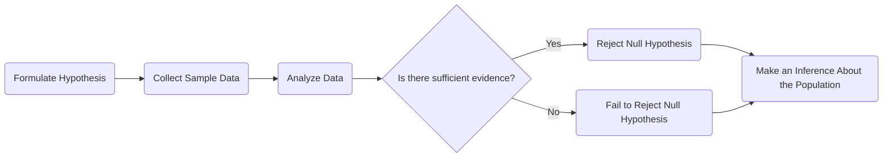

,# Testing of hypothesis and Prerequisite Knowledge 
A **hypothesis** is a **statement or assumption** about a **population parameter** (e.g., mean, proportion) that can be tested using statistical methods. It is the foundation of **hypothesis testing**, which determines whether there is enough statistical evidence in a sample to **infer** a conclusion about the entire population.
## Karl Poppers
Whenever there is a **conjecture** which is a statement that is not yet proved According to Karl Poppers it is easier to disprove it by showing **Empirical Evidence**. The conjecture is called the **Null Hypothesis** and the opposite of it is called the **Alternative Hypothesis**.
## Attributes
- Population : In testing of hypothesis the number of subjects that are measured is called the population.
- Sampling: The reduced amount of data.
	- It is used largely by government, industries., etc. when the data is too hard to collect and we collect a sample of the data.
- $H_0$ : Null Hypothesis
- $H_1$ : Alternative Hypothesis

## Surveys
- Surveys are used to collect data from a population.
- The data is collected from a sample of the population.
- The data is then analyzed to make a statement about the population.
## Parameters & Statistics
We use greek for population and english for sample.
Population measures like mean ($\mu$) and variance $\sigma^2$ are called parameters. The sample measures like mean ($\bar{x}$) and variance $s^2$ are called statistics.

---
## Statistical Hypothesis
- ### Hypothesis
	- A new drug significantly reducing blood pressure.
- ### Null Hypothesis
	- Definition
		- A definite statement about a population parameter which is tested for possible rejection under the assumption that it is true. It is usually a hypothesis of no difference. Represented by $h_0$
	- The new drug does not reduce blood pressure compared to a placebo.
- ### Testing Process
	- Researchers would conduct a clinical trial, and if the data shows a statistically significant decrease in blood pressure in the drug then the hypothesis could be accepted Else it is rejected
- ### Alternative Hypothesis 
	- Any hypothesis that is a complementary to null hypothesis is called an alternative hypothesis and is denoted by $h_1$.
---
### Types of errors
- **Type 1 Error**
	- Rejecting a true null hypothesis. The probability of making a type 1 error is denoted by $\alpha$
	  P(Rejecting $H_0$ | $H_0$ ) = $\alpha$)
		- **Example**
			- Convicting an innocent person.
			- 100 Phones, 10 phones were sampled for test. produced we found 1 defected box so it was a type 1 error.
- **Type 2 Error**
	- Accepting a false null hypothesis.. The probability of making a type 2 error is denoted by $\beta$
	  P(Accepting $H_0$ | $H_1$ ) = $\beta$)
		- **Example**
			- Acquitting a guilty person.
			- 100 Phones produced, 10 phones were sampled for test. no defected phones were point we have a type 2 error.
- $\alpha$ and $\beta$ is referred to as Producer's Risk and Consumer's Risk respectively.

---
### Example Problems
#### Example 1
Average Marks of boys are not same as average marks of girls
Let average marks for boys be $\mu_1$ and average marks of girls be $\mu_2$
$H_0: \mu_1 = \mu_2$  
$H_1: \mu_1 \neq \mu_2$

#### Example 2
Average Height of boys is more than average height of girls
Let average height for boys be $\mu_1$ and average height of girls be $\mu_2$
$H_0: \mu_1 = \mu_2$  
$H_1: \mu_1 > \mu_2$

---
## One Tailed & Two Tailed Test
Out of a sample size $n_1$ and the average $\bar{x_{1}}$ then we took a different sample $n_2$ and the average was $x_2$ Like this we took $n_n$ 
- $h_0$ : $\mu = \mu_{0}$
	- $h_1$ : $\mu > \mu_{0}$  Right Tailed Test
	- $h_1$ : $\mu$ < $\mu_{0}$  Left Tailed Test
- Two Tailed  $\mu = \mu_0$
	- Against $h_1$ : $\mu \neq \mu_0$

---

## Level of significance
The probability lets say $\alpha$ of rejecting a true null hypothesis is called the level of significance. $p(\text{Rejecting } H_0 | H_0) = \alpha$ .

The level of significance is the probability of rejecting a true null hypothesis. It is denoted by $\alpha$.

If we know the probability of $\alpha$ then we can calculate the $Z$ Value. The $Z$ value is the number of standard deviations a data point is from the mean. 

#### Example 
If the $\alpha=0.05$ we look closely at the Z table and find that the value of $Z_{\alpha}$ is 1.96.

### Confidence Interval
The confidence interval is the range of values within which the true value of the parameter is expected to lie with a certain level of confidence. The confidence interval is denoted by $1-\alpha$ where $\alpha$ is the level of significance.
$$(\bar{X}-{Z_{\alpha}} \frac{\sigma}{\sqrt{n}}, \bar{X}+{Z_{\alpha}} \frac{\sigma}{\sqrt{n}})$$

# Tests of significance Problems
## Question 1
Test of significance between population mean and sample mean. 
A sample size is considered larger if the sample size is greater than 30. If the sample size is less than 30 then the sample size is considered small.

## Question 1
Sample size = 100
Standard Deviation $\sigma$ = 10cm
Sample Mean $\bar{X}$ = 160cm
Mean Height $\mu$ = 165cm

$H_0: \mu = 165$  
$H_1: \mu \neq 165$   ( Two Tailed Test )

$\alpha = 0.05$
$Z_{\alpha}=1.96$

Solving Test statistics of
$|Z|<Z_{\alpha}$

$Z = \frac{\bar{X}-\mu}{\frac{\sigma}{\sqrt{n}}} = \frac{160-165}{\frac{10}{\sqrt{100}}} = -5$
$|Z| = Z > Z_{\alpha}$
$5 > 1.96$ 
Reject $H_0$

$\text{Conclusion: Reject } H_0$

## Question 2
A random sample of 200 measurements from a large population has a mean of 50 and a standard deviation of 10. Test the hypothesis that the population mean is 52 against the alternative hypothesis that the population mean is not 52. Use a level of significance of 0.05.

$H_0: \mu = 52$  

# T Test
If the sample size is less than 30 then the sample size is considered small. The test statistic is calculated using the t-distribution.
degrees of freedom = n-1
$T_{\alpha}$ is the t value for the level of significance $\alpha$ and degrees of freedom $n-1$.

$$
\bar{x} = \frac{{x_1 + x_2 + x_3 + \cdots + x_n}}{n}
$$
When $\bar{x}$ is known we can ignore only one value thus degree of freedom is $n-1$.

$$
T = \frac{\bar{X}-\mu}{\frac{s}{\sqrt{n-1}}}
$$

Properties of t-distribution
- The t-distribution is symmetric about the mean.
- The t-distribution has a mean of 0.
- The t-distribution is more spread out than the standard normal distribution.

$$
T=\frac{\left({\bar{X}}_{1}-{\bar{X}}_{2}\right)}{\sqrt{\frac{s_{1}^{2}}{n_{1}}+{\frac{s_{2}^{2}}{n_{2}}}}}
$$
# Problems Small Dataset

### Question 1
A machine solvses a problem in 1.75 seconds. A new machine is introduced and the time taken to solve the problem is 1.85 seconds. The standard deviation is 0.1. Test the hypothesis that the new machine is inferior to the old machine. Use a level of significance of 0.05.
$n = 10$
$H_0:\mu=1.75 \to$ machine is not inferior
$H_1:\mu \neq 1.75 \to$ Two tailed Test Machine is inferior
$\bar{X}=1.85$
$\sigma=0.1$
$\alpha=0.05,\text{    df = n-1=9}$
$T_{\alpha} = 2.262$

$$
T = \frac{{1.85-1.75 }}{{\frac{0.1}{\sqrt{9}}}} = 3
$$

### Question 2
A certain injection is administered will it always 

$n=12$
$\bar{X}=2.4167$
$\sigma=3.09$

$H_{0}:\mu=0\to$ There 
$H_{1}:\mu>0\to$ There is a significant difference 

# TOS of difference between two large sample means
Testing of significance of difference between two large samples means. 
We will now have two values of $\bar{X}$ and two values of $\sigma$ and two values of $n$. We will also calculate the $Z$ value for the two samples. 
If student 1 is asked to get a sample of college students with marks and student 2 is asked to get another sample. The standard deviation will remain the same. This is because student 1 and student 2 

When the samples are too large it will follow standard normal distribution. 
When the samples are too small it will follow the t-distribution.
Assumption will be made on the basis of sample size. 

### Cases:
- **Case 1:** $\sigma_1 = \sigma_2$ and known
- **Case 2:** $\sigma_1 = \sigma_2$ and unknown
- **Case 3:** $\sigma_1 \ne \sigma_2$ and known
- **Case 4:** $\sigma_1 \ne \sigma_2$ and unknown

### Formulas:

#### Case 4 Formula:
$$
z = \frac{\bar{x}_1 - \bar{x}_2}{\sqrt{\frac{s_1^2}{n_1} + \frac{s_2^2}{n_2}}} \sim N(0,1)
$$

#### Case 3 Formula:
$$
z = \frac{\bar{x}_1 - \bar{x}_2}{\sqrt{\frac{\sigma_1^2}{n_1} + \frac{\sigma_2^2}{n_2}}}
$$

#### Case 1 Formula:
$$
z = \frac{\bar{x}_1 - \bar{x}_2}{\sigma \sqrt{\frac{1}{n_1} + \frac{1}{n_2}}}
$$

#### Case 2 Formula:
$$
z = \frac{\bar{x}_1 - \bar{x}_2}{\sqrt{\frac{s^2}{n_1} + \frac{s^2}{n_2}}}
$$

## Test of significance of difference between two sample means ( Small Samples )
$$t={\frac{{\bar{x}}_{1}-{\bar{x}}_{2}}{\sqrt{{\frac{n_{1}s_{1}^{2}+n_{2}s_{2}^{2}}{n_{1}+n_{2}-2}}\left({\frac{1}{n_{1}}}+{\frac{1}{n_{2}}}\right)}}}$$
## Questions
Samples of two types of electric bulbs is given

|         | Size | Mean | Standard Deviation |
| ------- | ---- | ---- | ------------------ |
| Sample1 | 8    | 1214 | 36                 |
| Sample2 | 7    | 1036 |                    |

# Questions based on TOS
The average marks scored by 32 boys is 72 with an sd of 8 while that for 36 girls is 70 with an SD of 6. Test at 1% LOS whether the boys perform better than girls.

# Paired Testing 
When there are two different instances of same sample we can use paired testing.
In the case of the example where students first exam and second exam
Let $x_1$ be the marks of the first exam and $x_2$ be the marks of the second exam. 
$d = x_1 - x_2$ is the difference between the two exams. 
$\bar{d}=\frac{1}{n}\sum(x_{1}-x_{2})$
$s^2_d = \frac{1}{n}\sum(x_{1}-x_{2}-\bar{d})^2$
or 
$s^2_d = \frac{1}{n}\sum(x_{1}-x_{2})^2 - \frac{1}{n}\sum(x_{1}-x_{2})^2$
$s^2=var(d)=\frac{1}{n}$
The test statistic is giveen by
$t=\frac{\bar{d}}{\frac{s}{\sqrt{n-1 }}}\sim t(n-1) d.f.$

# F Test
We move from comparing mean to comparing variance. Proportions cannot be compared for very small samples. So for samples of large size we use F test that is variance.
Test of significance of difference between two small sample variance. For this we use the F test and the F distribution table.
It is always right tailed.
It is defined only for positive values 

Step 1 : Sample Size ( F Test is only for Small Sample)
Step 2 : $H_0 : \sigma_{1}^2= \sigma_{2}^2$
Step 3: $H_1 : \sigma_{1}^2 > \sigma_{2}^2$
The F- Test Statistic is calculated as 
$$
F = \frac{S_{1}^{2}}{S_{2}^{2}}
$$
Where $S_1^2$ and $S_2^2$ are the sample variances of the two samples.
If the calculated value of F is greater than the critical value of F then we reject the null hypothesis.
If the calculated value of F is less than the critical value of F then we fail to reject the null hypothesis.

Larger Variance is taken as numerator and taken as ${S_1}^2$
The degrees of freedom for the F distribution are $n_1-1$ and $n_2-1$ where $n_1$ and $n_2$ are the sample sizes of the two samples.
If alpha changes the table changes

Step 4 : Critical Value
**Example**
$n_1=8$
$n_2=7$
${S_1}^2=2.059$
${S_2}^2=10.10$
$F = \frac{10.10}{2.059}$
$F = $

$\hat{{S_{1}}^2}=\frac{{n_{1}S_{1}^2}}{n_{1}-1}$
$\hat{{S_{2}}^2}=\frac{{n_{2}S_{2}^2}}{n_{2}-1}$

$F = \frac{\hat{{S_{1}}^2}}{\hat{{S_{2}}^2}}$

Step 5 is conclusion

Notice how we wrote the large variance above

## Questions on F Test
A company wants to compare the variability in the productivity of two machines A and B. The company takes a sample of 10 observations from machine A and 12 observations from machine B. The sample variances are 4.5 and 2.5 respectively. Test the hypothesis that the variability in the productivity of the two machines is the same at 5% level of significance.

# References

###### Information
- date: 2025.03.12
- time: 14:05