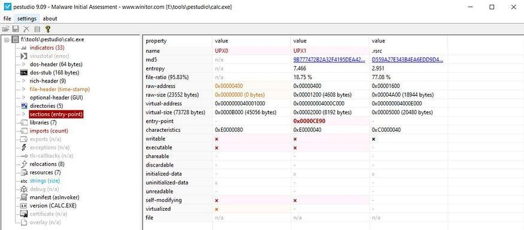
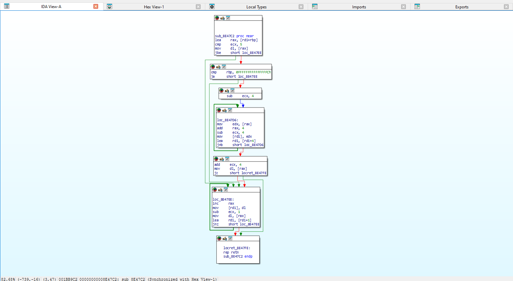
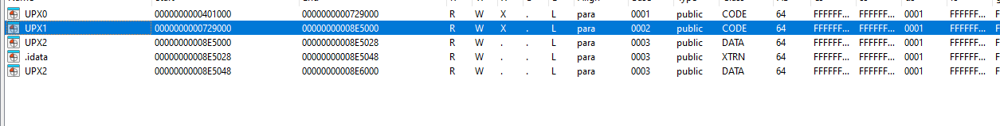
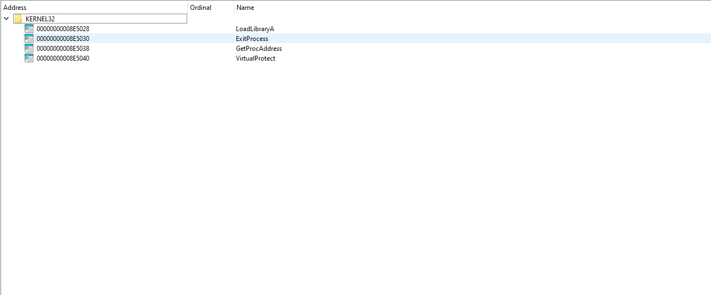
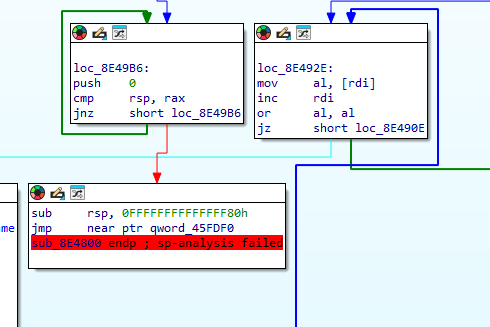
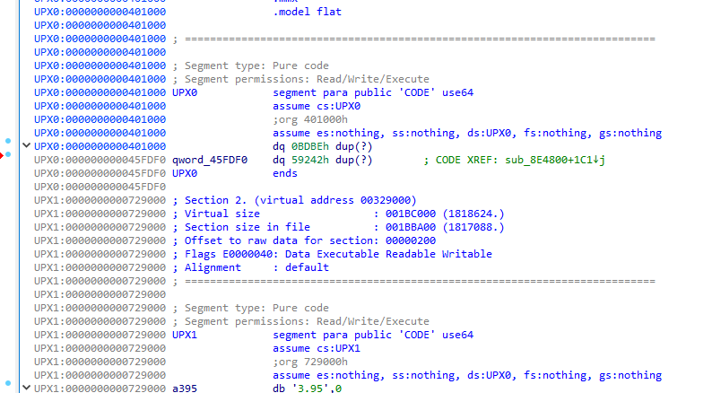
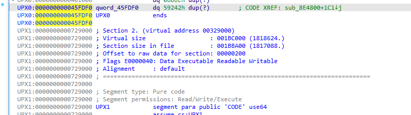
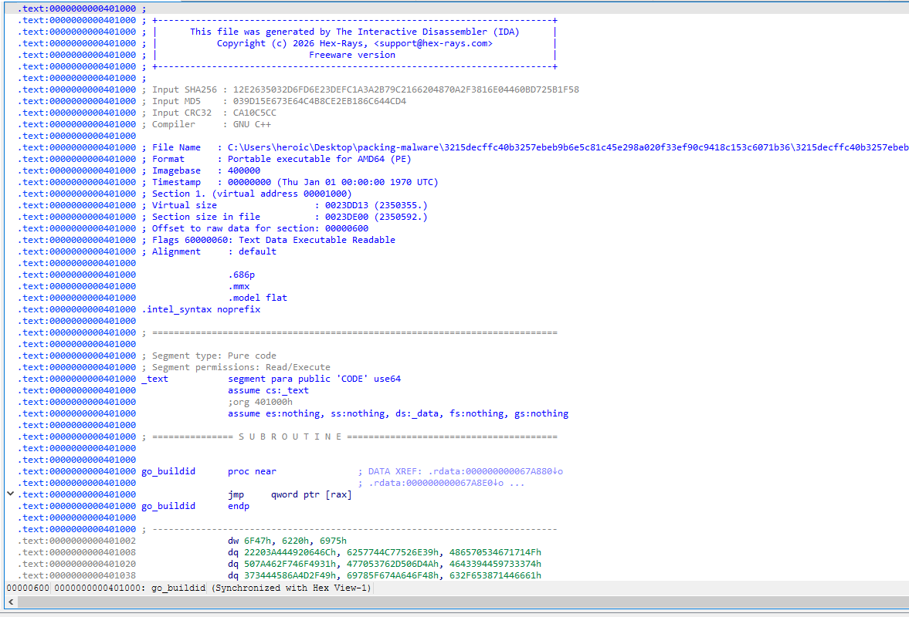
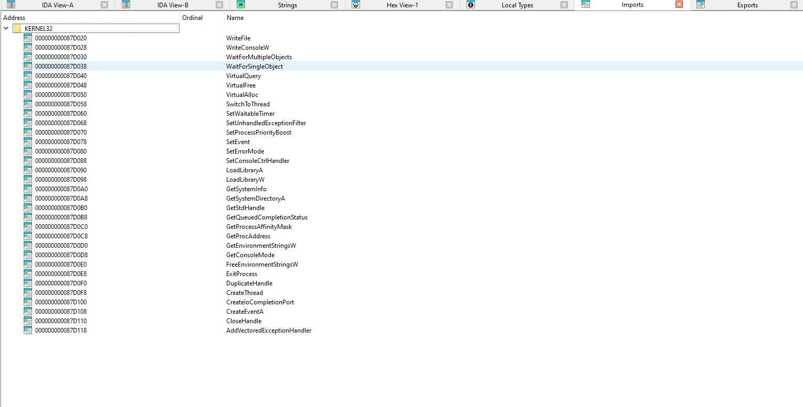

---

Title: "REMA LAB 9 Malware Obfuscation Techniques"

Status:

marker:

tags:

Date: "2026.04.21"

Time: "11:30"

---
# Experiment No. 9
## Recognizing Packed Malware and Unpack It with Various Tools

## Aim
Recognize packed malware and unpack it with various tools.

## Title
Malware obfuscation techniques.

## Part A: Theory
Packing and obfuscation are commonly used to hide malware behavior and bypass pattern-based detection. They make reverse engineering harder by modifying the executable structure and delaying access to original malicious logic.

These techniques are also used by legitimate software to protect intellectual property and reduce direct code theft or cracking.

### Packing
Packing is a subset of obfuscation. A packer modifies program formatting by compressing or encrypting executable data.

A packed executable usually includes:
- A new PE header
- One or more packed sections
- A decompression (or decryption) stub

The original entry point is relocated or obfuscated in the packed area, which makes static analysis harder (for example, identifying the Import Address Table and the original entry point).

### Typical Packing Flow
- The original executable is passed through a packer.
- Original code and PE structure are compressed or encrypted.
- A stub is added to unpack content at runtime.
- Control is eventually transferred to the original entry point after unpacking.

### Popular Packers
- UPX
- Themida
- The Enigma Protector
- VMProtect
- Obsidium
- MPRESS
- Exe Packer 2.300
- ExeStealth

### How UPX Works
A UPX-packed executable contains three key components:
- **Stub:** Runtime unpacking code and initial entry point.
- **Compressed executable:** Original binary content in compressed form.
- **Reserved/empty runtime space:** Section (commonly UPX0) used to hold unpacked code during execution.

### Runtime Unpacking Sequence
During execution, the unpacking stub performs:
1. Extraction of packed content.
2. Import resolution.
3. Memory/permission restoration (for example, via VirtualProtect).
4. Jump to the original entry point.

## Part B: Practical Work
1. Referenced study material: https://medium.com/@dbragetti/unpacking-malware-685de7093e5
2. Packed an EXE file using UPX.
3. Unpacked a UPX-packed file.
4. Compared header details of original and packed executables (IDA Pro).
5. Compared imports in packed vs unpacked executables.
6. Recorded observations with output screenshots.

## Output Screenshots

## Conclusion
Packing and obfuscation significantly increase analysis effort by hiding executable logic and delaying visibility of malicious behavior. UPX-packed binaries can be unpacked either with automated tools or through debugger-guided runtime analysis. Comparing headers and imports before and after unpacking provides a clear path to identify original execution behavior.

  

# References

###### Information
- date: 2026.04.21
- time: 11:30