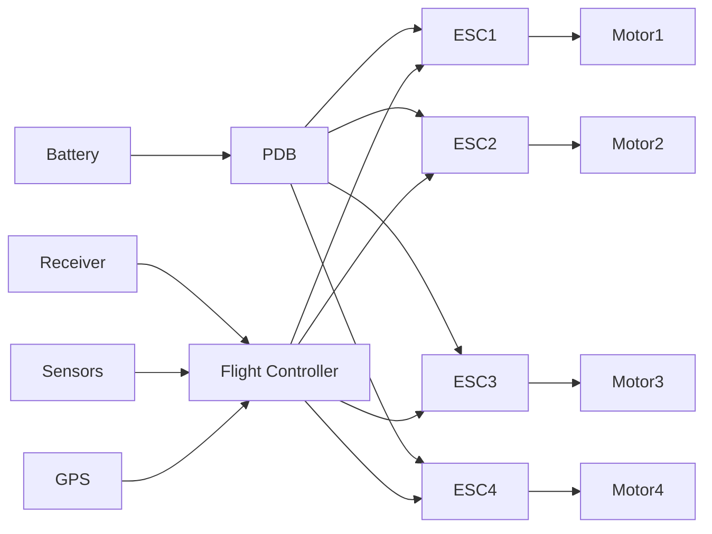
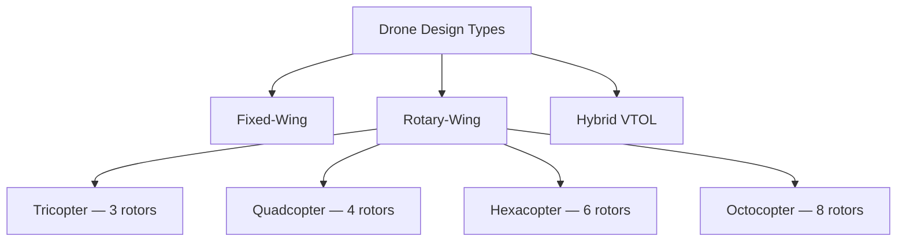

# Introduction to Drone Technology

**Related Notes**: [[Drone Technology Index]] | [[Aerial Terminology in Drones]] | [[Propellors & Motors]] | [[Electronic Speed Controller]] | [[Drone Batteries]]

**Unit**: [[Drone Technology Index#Unit 1|Unit 1 — Introduction to UAV Systems]]

---

## 1. What is a Drone?

A **Drone**, formally called an **Unmanned Aerial Vehicle (UAV)**, is an aircraft that operates **without a human pilot physically onboard**. Instead, it is either:

- **Remotely piloted** — controlled in real time by an operator using a radio transmitter, or
- **Autonomously operated** — guided by onboard computers using pre-programmed flight paths and sensor data.

The word "drone" originally came from military terminology. Today the term covers everything from a palm-sized toy to a bus-sized surveillance aircraft.

> **Why UAVs matter**: They eliminate risk to human pilots in dangerous missions, reduce cost, and enable applications in agriculture, cinematography, delivery, and disaster response.

---

## 2. Key Components of a Drone

Every drone, regardless of size or purpose, shares these core building blocks:

| # | Component | Role |
|---|-----------|------|
| 1 | **Frame** | Structural skeleton — holds everything, determines form factor |
| 2 | **Propellers** | Rotating blades that generate lift by accelerating air downward |
| 3 | **Brushless DC Motors (BLDC)** | Convert battery electricity into shaft rotation that spins props |
| 4 | **Electronic Speed Controller (ESC)** | Translates flight controller commands into precise motor RPM |
| 5 | **Flight Controller (FC)** | The "brain" — reads sensors, runs stabilisation algorithms, commands ESCs |
| 6 | **Battery (LiPo)** | Lithium Polymer pack — primary energy source for all electronics |
| 7 | **Power Distribution Board (PDB)** | Routes battery power to all ESCs and the FC |
| 8 | **Transmitter & Receiver** | RC radio link between pilot and drone (typically 2.4 GHz) |
| 9 | **GPS Module** | Provides position data for autonomous waypoint navigation and loiter |
| 10 | **Sensors** | IMU (accel+gyro), barometer, magnetometer — for stable, accurate flight |

### How the Components Interact

The **pilot sends a command** → **receiver** picks it up → **flight controller** interprets it using sensor feedback → **ESCs** adjust motor speeds → **propellers** generate differential thrust → drone moves.

---

## 3. Classification of Drones

Drones are classified along multiple axes. Understanding each helps in selecting the right UAV for a task.

### 3.1 By Design / Configuration

| Type | How it Works | Pros | Cons | Examples |
|------|-------------|------|------|---------|
| **Fixed-Wing** | Lift from aerodynamic wings (like a plane), needs forward motion | High speed, long endurance | Needs runway/hand-launch, cannot hover | Military HALE UAVs, Wingtra |
| **Rotary-Wing** | Lift from spinning rotors — VTOL capable | Hover in place, precise positioning | Higher power draw, shorter range | Quadcopters, hexacopters |
| **Hybrid VTOL** | Wings + rotors — takes off vertically, cruises on wings | Best of both worlds | Complex, expensive | Amazon delivery concepts |

> **Most consumer/hobby drones are quadcopters** because 4 motors is the minimum for full 6-DOF control through differential thrust.

### 3.2 By Range & Endurance

| Category | Range | Typical Altitude | Use Case |
|----------|-------|-----------------|---------|
| Very Short Range | < 5 km | < 300 m | Local inspection, FPV racing |
| Short Range | 5–50 km | < 1500 m | Agricultural surveying |
| Medium Range | 50–200 km | < 3000 m | Border patrol, search & rescue |
| Long Range | 200–500 km | < 5000 m | Maritime surveillance |
| HALE (High Altitude Long Endurance) | > 500 km | > 15,000 m | Military ISR, stratospheric comms |

### 3.3 By Payload Capacity

| Class | Total Weight | Representative Example |
|-------|-------------|----------------------|
| Nano | < 250 g | Parrot Rolling Spider |
| Micro | 250 g – 2 kg | DJI Mini 3 |
| Mini | 2 – 20 kg | DJI Matrice 30 |
| Small | 20 – 150 kg | Wingcopter 198 |
| Large / MALE | > 150 kg | MQ-9 Reaper |

### 3.4 By Wing Type

| Type | Description |
|------|-------------|
| Fixed-Wing | Rigid, stationary wings — lift via aerodynamic forward motion |
| Rotary-Wing | Spinning blades act as wings — lift via rotation |
| Flapping-Wing (Ornithopter) | Mimics bird/insect flight — mostly experimental |

### 3.5 By Autonomy Level

| Level | Description | Pilot Role |
|-------|-------------|-----------|
| Manual | Pilot controls every axis in real time | Full control |
| Semi-Autonomous | FC handles stabilisation; pilot gives direction | High-level commands only |
| Fully Autonomous | Pre-planned mission, executes independently | Monitor only |
| FPV (First Person View) | Pilot flies from drone camera perspective in real time | Immersive piloting |

---

## 4. Applications of Drones

| Sector | Application |
|--------|-------------|
| Military & Defence | Surveillance, target acquisition, strike missions, logistics |
| Agriculture | Crop health mapping (NDVI), precision spraying, yield estimation |
| Search & Rescue | Locating survivors, delivering supplies in disaster zones |
| Aerial Photography | Stable footage, cinematic high angles, event coverage |
| Infrastructure Inspection | Bridges, power lines, pipelines — safer than rope access |
| Delivery Logistics | Last-mile delivery (Amazon Prime Air, Zipline medical) |
| Mapping & Surveying | Photogrammetry, LiDAR-based 3D terrain mapping |
| Environmental Monitoring | Wildlife tracking, deforestation analysis, weather sensing |

---

## 5. Regulatory Considerations (India)

Drones in India are governed by the **Drone Rules 2021** (Ministry of Civil Aviation):

- Drones > 250 g require **registration** on the Digital Sky Platform
- Operations beyond visual line of sight (BVLOS) require special approval
- No-fly zones include airports, military installations, and government buildings
- Airspace: **Green** (fly freely), **Yellow** (permission required), **Red** (no fly)

---

## See Also
- [[Aerial Terminology in Drones]] — Flight physics, thrust, roll/pitch/yaw explained
- [[Propellors & Motors]] — How propellers and BLDC motors work
- [[Electronic Speed Controller]] — How ESCs control motor speed
- [[Drone Batteries]] — LiPo battery chemistry and ratings
- [[Flight Controller & Communication]] — FC types, PWM, PX4
- [[Drone Technology Sensors]] — IMU, GPS, barometer, ultrasonic

---
*Unit 1 — Introduction to UAV Systems | Drone Technology — BTech Sem 5*