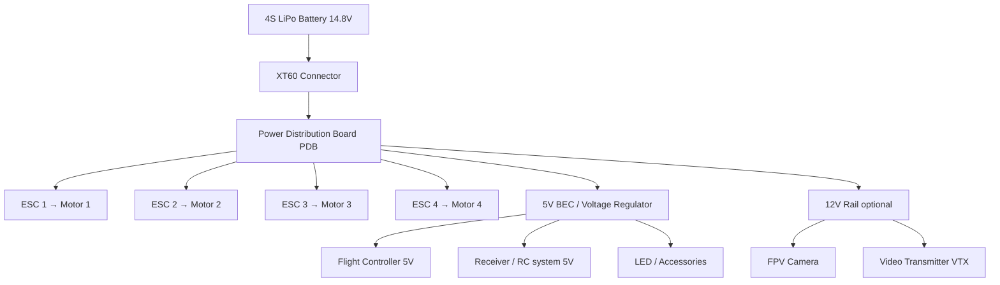

# Power Distribution in a Drone

**Related Notes**: [[Drone Technology Index]] | [[Drone Batteries]] | [[Electronic Speed Controller]] | [[Propellors & Motors]] | [[Flight Controller & Communication]]

**Unit**: [[Drone Technology Index#Unit 2|Unit 2 — Drone System Design Flow]]

---

## 1. Overview

Power distribution is the complete pathway by which **electrical energy flows from the battery** to every component that needs it. A well-designed power distribution system ensures:

- All motors receive **equal, stable voltage** at all times
- The flight controller and sensors receive **clean, regulated power**
- No component is under/over-voltage
- Wiring is neat and fault-tolerant

---

## 2. Power Distribution Architecture

### Typical 4S Quadcopter Power Chain

### Voltage Levels in a Typical Build

| Component | Voltage Needed | Source |
|-----------|---------------|--------|
| Motors (via ESC) | Full battery voltage (14.8V on 4S) | Battery direct via PDB |
| Flight Controller | 5V | BEC or voltage regulator |
| RC Receiver | 5V (some accept 3.3V) | BEC |
| FPV Camera | 5V or 12V | Filtered rail from PDB |
| Video Transmitter | 9–12V typically | Filtered 12V rail |
| GPS Module | 3.3V or 5V | FC internal regulator |
| Servos (if any) | 5V or 6V | BEC |

---

## 3. Power Distribution Board (PDB)

### 3.1 What it Does

The **PDB** is a PCB (Printed Circuit Board) that acts as a **central power hub**:

1. **Battery connection**: One XT60 or XT30 input distributes to all output pads
2. **ESC connections**: 4 (or 6/8) solder pads for ESC power leads
3. **Voltage regulation**: On-board switching regulators convert battery voltage to 5V and 12V
4. **Capacitor filtering**: Bulk capacitors smooth voltage spikes from motor switching (protect the FC)
5. **Current sensing**: Some PDBs have a current sensor to monitor total consumption

### 3.2 PDB vs All-in-One FC Stack

| Setup | Description | Pros | Cons |
|-------|-------------|------|------|
| Dedicated PDB | Separate board for power + separate FC | Easy replacement of components | More wiring |
| AIO FC Stack | FC + ESC + PDB integrated in one stack | Compact, clean build | Replacing one component means replacing all |
| 4-in-1 ESC | All 4 ESCs on one board | Very compact | Harder to repair |

Modern racing and freestyle builds typically use an **AIO FC+ESC stack** for minimal size.

---

## 4. Voltage Regulation

Raw battery voltage (14.8V on 4S) is too high for most electronics. Voltage regulators step it down:

| Regulator Type | Efficiency | Use |
|---------------|-----------|-----|
| **Linear (LDO)** | ~50% | Small loads only — wastes excess as heat |
| **Switching (Buck)** | ~85–93% | Preferred for drone builds — efficient |
| **BEC in ESC** | ~85% | Powers FC/receiver in small drones |

### Why Clean Power Matters

Motors and ESCs produce **high-frequency electrical noise** (EMI) from MOSFET switching. This noise can:
- Corrupt sensor data (gyro, accelerometer)
- Cause FC brownouts (resets in flight)
- Degrade RC receiver signal

**Mitigation**: LC filters, capacitors across power lines, physical separation of power and signal wires.

---

## 5. Connectors & Wiring

### Battery Connectors

| Connector | Max Current | Used For |
|---------|------------|---------|
| **XT30** | 30 A | Small/micro drones |
| **XT60** | 60 A | Standard quadcopters (most common) |
| **XT90** | 90 A | Large/heavy-lift UAVs |
| **AS150** | 150 A | Industrial / Very large UAVs |

### Wire Gauge

Higher current requires thicker wire to minimize resistance and heat:

| Wire Gauge (AWG) | Max Continuous Current | Common Use |
|----------------|----------------------|-----------|
| 24 AWG | ~3 A | Signal wires |
| 20 AWG | ~8 A | BEC output, LEDs |
| 18 AWG | ~15 A | Small motor leads |
| 16 AWG | ~22 A | Medium motors |
| 14 AWG | ~32 A | Main battery leads for 5″ builds |
| 12 AWG | ~40+ A | Large drones, heavy-lift |

---

## 6. Common Power Issues & Solutions

| Problem | Cause | Solution |
|---------|-------|---------|
| FC rebooting in flight | Voltage dip from motor spike | Add bulk capacitor (1000µF 35V) at battery leads |
| Motors running at unequal speed | ESC voltage mismatch | Replace PDB, check solder joints |
| ESC overheating | Undersized ESC or poor airflow | Use larger ESC rating; expose to airflow |
| Battery draining faster than expected | Short circuit or poor connector | Check connectors, inspect wiring |
| FPV video static | EMI from motors | Filter cap on camera/VTX power, better routing |

---

## See Also
- [[Drone Batteries]] — Battery specs that define system voltages
- [[Electronic Speed Controller]] — ESC current draw shapes PDB requirements
- [[Propellors & Motors]] — Motors determine peak current draw
- [[Flight Controller & Communication]] — What the FC needs from the power system

---
*Unit 2 — Drone System Design Flow | Drone Technology — BTech Sem 5*
