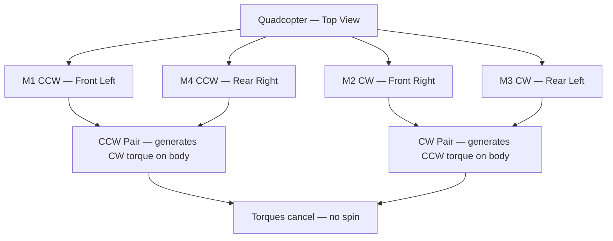

# Propellers & Motors

**Related Notes**: [[Drone Technology Index]] | [[Drone]] | [[Aerial Terminology in Drones]] | [[Electronic Speed Controller]] | [[Thrust Dependencies]]

**Unit**: [[Drone Technology Index#Unit 2|Unit 2 — Drone System Design Flow]]

---

## 1. Overview

The **propulsion system** is the heart of a drone. It converts stored electrical energy into mechanical motion — the spinning propellers that push air down and lift the drone up.

Two components work in tandem:
- **Motors** — convert electrical energy into rotational mechanical energy
- **Propellers** — convert rotational energy into aerodynamic thrust

Their pairing critically determines the drone's **speed, efficiency, payload capacity, and maneuverability**.

---

## 2. Propellers

### 2.1 What a Propeller Does

A propeller is an aerodynamic blade assembly that generates thrust by **accelerating a column of air downward**, creating a reaction force that pushes the drone upward (Newton's 3rd law).

The **four functions** of propellers in a drone:

| Function | Explanation |
|----------|-------------|
| **Generate Lift** | Creates pressure difference — lower pressure above, higher below — generating upward thrust |
| **Control Motion** | Differential RPM between propellers creates pitch, roll, and yaw |
| **Stabilise Flight** | CW and CCW pairs cancel rotational torque: $\sum\tau_{CW} = \sum\tau_{CCW}$ |
| **Enhance Efficiency** | Optimised blade profiles reduce drag, improve thrust-to-power ratio |

### 2.2 Propeller Sizing Notation

Propellers are described as **Diameter × Pitch** in inches. For example, **10×4.5** means:
- **10 inches** diameter
- **4.5 inches** pitch (theoretical advance per revolution)

### 2.3 Pitch — The Key Performance Parameter

**Pitch** is the theoretical distance a propeller would advance in one revolution through a solid medium (no slippage).

| Pitch Type | Blade Angle | Air per Revolution | Best At |
|------------|------------|-------------------|---------|
| **Low Pitch** (3–5″) | Shallow | Less — but efficiently | Efficiency, stability, endurance |
| **High Pitch** (6–10″+) | Steep | More — draws more power | Speed, aggressive thrust |

#### Low-Pitch Propellers (Endurance-Optimised)

$$\eta = \frac{T \cdot v}{P_{\text{input}}}$$

- Shallow blade angle → less drag → motor works less hard
- Better efficiency: same thrust with less power
- Stable, smooth flight with minimal vibration
- Longer flight time from the same battery
- **Best for**: aerial photography, survey drones, endurance missions

#### High-Pitch Propellers (Performance-Optimised)

$$T \propto P \times n^2 \times D^4$$

- Steep blade angle → moves more air per revolution
- Higher thrust and top speed but increased current draw
- Motor must work harder → battery drains faster
- More vibration but quicker altitude changes
- **Best for**: racing drones, heavy-lift industrial UAVs, aggressive flight

| Parameter | Low Pitch | High Pitch |
|-----------|-----------|------------|
| Efficiency | High | Low |
| Flight Time | Longer | Shorter |
| Top Speed | Lower | Higher |
| Motor Load | Less | More |
| Vibration | Less | More |
| Best Use | Photography, survey | Racing, heavy-lift |

### 2.4 Diameter — The Thrust Multiplier

$$T = C_T \cdot \rho \cdot n^2 \cdot D^4$$

Diameter has the **strongest influence on thrust** ($D^4$ relationship):
- Every 1 inch increase in diameter ≈ **16% increase in thrust**
- Larger props demand **more torque** → low-KV motors required
- Larger props are **heavier** → more motor and frame strength needed

### 2.5 Propeller Design Variants

#### By Number of Blades

| Type | Description | Pros | Cons | Use Case |
|------|-------------|------|------|---------|
| **2-blade** | Simple, common | Low drag, high speed, long flight time | Less smooth | Racing, fixed-wing |
| **3-blade** | Balanced | Better stability, moderate efficiency | Slightly more drag | FPV, general purpose |
| **4+ blade** | High lift, low noise | Smooth, stable flight | Reduced efficiency | Cinema, payload drones |

#### By Blade Shape

| Shape | Effect | Application |
|-------|--------|-------------|
| **Straight Edge** | Less air resistance, faster response | Racing, agility |
| **Curved/Tapered Edge** | Smoother airflow, greater lift | Photography, surveying |
| **Foldable** | Hinged blades, collapsible | Travel, portability |

#### By Material

| Material | Weight | Efficiency | Durability | Cost |
|----------|--------|-----------|-----------|------|
| **Plastic (Nylon)** | Light | Moderate | Flexible but deforms | Cheap |
| **Carbon Fiber** | Very light | High | Stiff but brittle on impact | Expensive |
| **Wood** | Moderate | Good | Less durable in crashes | Rare |

### 2.6 CW vs CCW Propellers

Quadcopters use two pairs of contra-rotating propellers to cancel torque:

Yaw is controlled by deliberately unbalancing these torque pairs.

---

## 3. Motors

### 3.1 Types of Motors Used in Drones

| Type | Mechanism | Used In |
|------|-----------|---------|
| **Brushed DC** | Carbon brushes make/break circuit to commutate | Toy/micro drones only |
| **Brushless DC (BLDC)** | Electronic commutation via ESC — no brushes | Almost all modern drones |
| **Coreless Brushed** | No iron core — very light, fast response | Nano/micro drones |

> **Almost all mid-to-large drones use BLDC motors** because of their high efficiency (85–95%), long lifespan (no brush wear), precise speed control, and excellent power-to-weight ratio.

### 3.2 Brushless Motor Subtypes

| Subtype | Rotor Position | Characteristics | Best For |
|---------|---------------|-----------------|---------|
| **Inrunner** | Rotor inside stator | High RPM, low torque | Fixed-wing EDFs, car motors |
| **Outrunner** | Rotor outside stator (bell spins) | Lower RPM, higher torque | **Multirotors** — most common |

Outrunner motors produce enough torque to spin large propellers directly without a gearbox.

### 3.3 KV Rating — The Most Important Motor Specification

$$\text{Motor RPM} = KV \times V$$

where:
- $KV$ = Motor velocity constant (RPM per Volt)
- $V$ = Supply voltage

**Example**: A **2200 KV** motor on an **11.1V (3S LiPo)**:
$$2200 \times 11.1 = 24{,}420 \text{ RPM}$$

#### High KV vs Low KV Motors

| Parameter | High KV (2000–3500) | Low KV (700–1200) |
|-----------|--------------------|--------------------|
| RPM per Volt | High | Low |
| Torque | Low | High |
| Propeller Size | Small (3–6″) | Large (8–15″) |
| Efficiency | Low — wastes energy as heat | High — efficient thrust |
| Cooling | Poor — generates more heat | Better |
| Motor Size | Small, lightweight | Larger, heavier |
| Battery Draw | High current, quick drain | Lower current draw |
| Best For | Racing, FPV | Aerial photography, heavy-lift |

**Rule of thumb**: 
- High KV + Small Prop = **Speed** 
- Low KV + Large Prop = **Efficiency & Payload**

### 3.4 Motor Naming Convention

Brushless motors are named by their stator dimensions. For example, **2212** means:
- **22 mm** stator diameter
- **12 mm** stator height

A taller, wider stator = more winding space = more torque.

### 3.5 Motor Current & Efficiency

- ESCs must be rated at **at least 1.2× the motor's max current** to prevent overheating
- Torque and RPM are inversely related: at fixed voltage, higher torque demands → lower RPM
- Motor efficiency peaks at a specific RPM range — propeller sizing should keep the motor in this range

---

## 4. Thrust Dependencies

The full thrust equation:

$$T \propto (KV \times V)^2 \times D^4 \times P$$

Breaking down each dependency:

| Factor | Relationship | Effect of Increasing |
|--------|------------|---------------------|
| KV rating | $T \propto KV^2$ | Higher RPM → more thrust (but draws more current) |
| Battery voltage | $T \propto V^2$ | Higher voltage → more RPM → more thrust |
| Propeller diameter | $T \propto D^4$ | Very strong effect — small diameter increase = large thrust gain |
| Propeller pitch | $T \propto P$ | Linear — higher pitch = more thrust per revolution |
| Blade count | Moderate increase | More blades, more thrust but diminishing returns |
| Blade material | Indirect | Stiffer blades (carbon fiber) flex less → more efficient thrust |

---

## 5. Choosing the Right Motor–Propeller Pairing

| Drone Type | Motor KV | Prop Size | Battery |
|-----------|---------|----------|--------|
| Mini FPV Racer | 2400–3000 KV | 3–5″ | 4S LiPo |
| Freestyle FPV | 1800–2400 KV | 5–6″ | 4S/6S LiPo |
| Aerial Photography | 700–1000 KV | 8–12″ | 4S LiPo |
| Heavy-Lift Hexacopter | 300–600 KV | 12–20″ | 6S/12S LiPo |

---

## See Also
- [[Electronic Speed Controller]] — How ESCs make fine motor speed adjustments
- [[Drone Batteries]] — Power source specifications
- [[Power Distribution in a drone]] — How power flows from battery to motors
- [[Thrust Dependencies]] — Full analysis of thrust affecting factors
- [[Aerial Terminology in Drones]] — How pitch/roll/yaw use differential motor speed

---
*Unit 2 — Drone System Design Flow | Drone Technology — BTech Sem 5*
