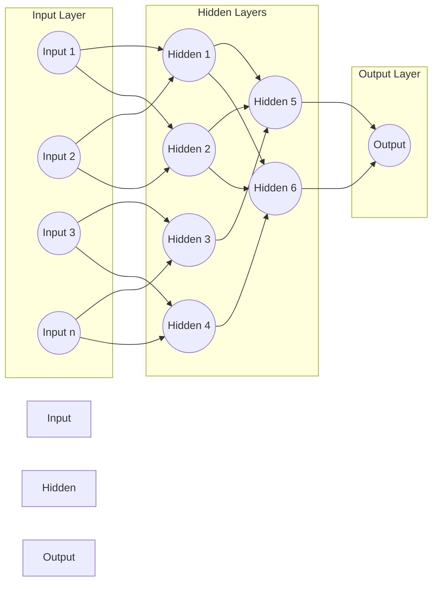

# Neural Networks

## Overview

Neural Networks are **adaptive systems that improve continuously** through learning. They are modeled after the human brain's structure and function, using interconnected nodes (neurons) that process information and learn patterns from data.

## Core Concept

Neural networks excel at **learning relationships between data that have outputs that are nonlinear and complex**. Unlike traditional machine learning algorithms that work well with linear relationships, neural networks can capture intricate, non-linear patterns in data.

## Key Terminologies

### Neurons
The basic computational units in a neural network, analogous to biological neurons in the brain. Each neuron receives inputs, processes them, and produces an output.

### Synapses
The connections between neurons that transmit signals. In artificial neural networks, these are represented as weighted connections between nodes.

### Weights
Numerical values assigned to each connection between neurons. Weights determine the strength and importance of the input signal. **When the difference is too high between prediction and actual output, we change the weights** through the learning process.

### Biases
Additional parameters added to neurons that allow the model to fit the data better by shifting the activation function. They provide flexibility in the model's learning capacity.

### Propagation Function
The mathematical function that combines inputs and weights to produce an output signal that propagates through the network.

### Learning Rule
The algorithm that determines how weights and biases are updated during training. Common examples include backpropagation and gradient descent.

### Activation Function
A mathematical function applied to a neuron's output that introduces non-linearity into the network, enabling it to learn complex patterns. Common activation functions include:
- ReLU (Rectified Linear Unit)
- Sigmoid
- Tanh
- Softmax

## Neural Network Architecture

Neural networks consist of three main types of layers:



### Input Layer
Receives the raw input data. Each neuron in this layer represents one feature of the input data.

### Hidden Layer
Where the actual processing happens. Data **passes onto the Hidden Layer** from the input layer. Modern deep neural networks can have a **large number of hidden layers**, which is why they're called "deep" learning models. These layers extract increasingly abstract features from the data.

### Output Layer
Produces the final prediction or classification result.

## Connection to Feature Selection

[[Feature Selection]] is crucial in neural network design, just as it is in traditional machine learning.

As we discussed in feature selection, when working with datasets containing 40-50 columns, **we wouldn't need all 50 columns for traditional learning**. The same principle applies to neural networks:

- Too many irrelevant features can lead to overfitting
- Neural networks can learn which features are important through their weights
- However, preprocessing with feature selection can improve training efficiency and model performance
- Input layer size is determined by the number of features we choose to include

## The Black Box Nature

Neural networks are often criticized for their **black box nature** - it's difficult to understand exactly how the network arrives at its decisions. While we can see the input and output, the complex interactions happening in the hidden layers are not easily interpretable. This is particularly challenging when:

- Debugging model errors
- Meeting regulatory requirements for explainability
- Building trust in critical applications (healthcare, finance)

## Practical Example: Should I Go Surfing?

Let's build a neural network to decide whether you should go surfing based on various conditions.

### Input Features with Weights and Biases

**Scenario Setup:**
- We have 4 input conditions
- 1 hidden layer with 2 neurons
- 1 output (Go Surfing: Yes/No)

**Input Features:**
1. **Wave Height** (0-10 scale)
2. **Water Temperature** (0-10 scale)
3. **Wind Speed** (0-10 scale)
4. **Weather Condition** (0-10 scale, where 10 is sunny)

### Network Configuration

#### Hidden Layer - Neuron 1 (Focuses on "Surf Conditions")
- Wave Height weight: **0.8** (high importance)
- Water Temperature weight: **0.3** (moderate importance)
- Wind Speed weight: **-0.6** (negative - high wind is bad)
- Weather Condition weight: **0.4** (moderate importance)
- Bias: **-2.0**

#### Hidden Layer - Neuron 2 (Focuses on "Comfort")
- Wave Height weight: **0.2** (low importance)
- Water Temperature weight: **0.9** (high importance)
- Wind Speed weight: **-0.3** (slight negative)
- Weather Condition weight: **0.7** (high importance)
- Bias: **-3.0**

#### Output Layer
- Hidden Neuron 1 weight: **0.9**
- Hidden Neuron 2 weight: **0.7**
- Bias: **-0.5**

### Example Calculation

**Perfect Surfing Day:**
- Wave Height: 8
- Water Temperature: 7
- Wind Speed: 2
- Weather: 9

**Hidden Neuron 1 (Surf Conditions):**
```
Sum = (8 × 0.8) + (7 × 0.3) + (2 × -0.6) + (9 × 0.4) + (-2.0)
Sum = 6.4 + 2.1 + (-1.2) + 3.6 + (-2.0) = 8.9
Activation (using ReLU): max(0, 8.9) = 8.9
```

**Hidden Neuron 2 (Comfort):**
```
Sum = (8 × 0.2) + (7 × 0.9) + (2 × -0.3) + (9 × 0.7) + (-3.0)
Sum = 1.6 + 6.3 + (-0.6) + 6.3 + (-3.0) = 10.6
Activation (using ReLU): max(0, 10.6) = 10.6
```

**Output Layer:**
```
Sum = (8.9 × 0.9) + (10.6 × 0.7) + (-0.5)
Sum = 8.01 + 7.42 + (-0.5) = 14.93
Activation (using Sigmoid): 1/(1 + e^(-14.93)) ≈ 0.9999
```

**Interpretation:** Output ≈ 1.0 → **YES, go surfing!** 🏄

The network learned that when both surf conditions and comfort factors are favorable, it strongly recommends surfing.

---

**Bad Surfing Day:**
- Wave Height: 2 (too small)
- Water Temperature: 3 (cold)
- Wind Speed: 9 (too windy)
- Weather: 3 (poor)

**Hidden Neuron 1:** Output ≈ 0 (poor surf conditions)
**Hidden Neuron 2:** Output ≈ 0 (uncomfortable)
**Final Output:** ≈ 0.0 → **NO, don't go surfing**

## Applications

### Automated Chatbots
Neural networks power modern conversational AI, enabling them to:
- Understand natural language context
- Generate human-like responses
- Learn from conversations over time
- Handle multiple languages and dialects

### Other Common Applications
- Image recognition and computer vision
- Speech recognition and synthesis
- Medical diagnosis
- Financial forecasting
- Autonomous vehicles
- Recommendation systems

## How Neural Networks Learn

1. **Forward Propagation:** Data flows from input → hidden layers → output
2. **Calculate Error:** Compare prediction with actual output
3. **Backward Propagation:** Calculate how much each weight contributed to the error
4. **Update Weights:** Adjust weights and biases to reduce error
5. **Repeat:** Continue this process thousands/millions of times

The network **adapts and improves continuously** through this iterative process.

---

## Related Notes
- [[Feature Selection]] - Choosing relevant features for model input
- [[Perceptrons]] - The building blocks of neural networks
- [[Deep Learning]] - Neural networks with many hidden layers
- [[Activation Functions]] - Non-linear transformations in neurons

---

*Last Updated: 2025-11-04*