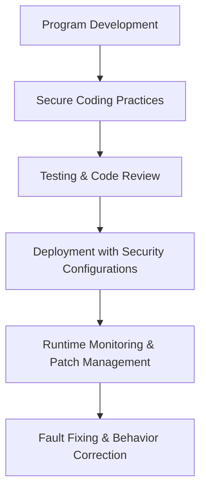

## Program Security

### Key Questions

- **How do we keep programs free from flaws?**
    - Through secure coding practices, code reviews, and automated testing.
- **How do we protect computing resources against programs that contain flaws?**
    - By sandboxing, access control, and runtime monitoring.
- **Presented with a finished product (e.g., commercial software), how can you tell how secure it is or how to use it in its most secure way?**
    - By reviewing vendor documentation, applying patches, and configuring security settings properly.

---

## Secure Programs

- **Security implies trust**: A secure program enforces **confidentiality, integrity, and availability (CIA triad)**.
- **Assessment of security**:
    - Static and dynamic analysis of code.
    - Penetration testing and fuzzing.
    - Reviewing compliance with standards (e.g., OWASP, ISO/IEC 27001).

---

## Fixing Faults and Unexpected Behaviors

### Faults

- **Definition**: Errors in design, coding, or configuration that can lead to vulnerabilities.
- **Mitigation**:
    - Regular patching and updates.
    - Root cause analysis and corrective coding.
    - Defensive programming techniques.

### Unexpected Behaviors

- **Definition**: Program actions outside intended functionality, often exploited by attackers.
- **Mitigation**:
    - Input validation and sanitization.
    - Exception handling to prevent crashes.
    - Logging and monitoring to detect anomalies.

---

## Workflow for Secure Programs

---

## Key Insights

- Secure programs are not just about **writing flawless code**, but also about **operational safeguards**.
- **Faults and unexpected behaviors must be anticipated** and mitigated through layered defenses.
- Security assessment is continuous: from design → development → deployment → maintenance.
